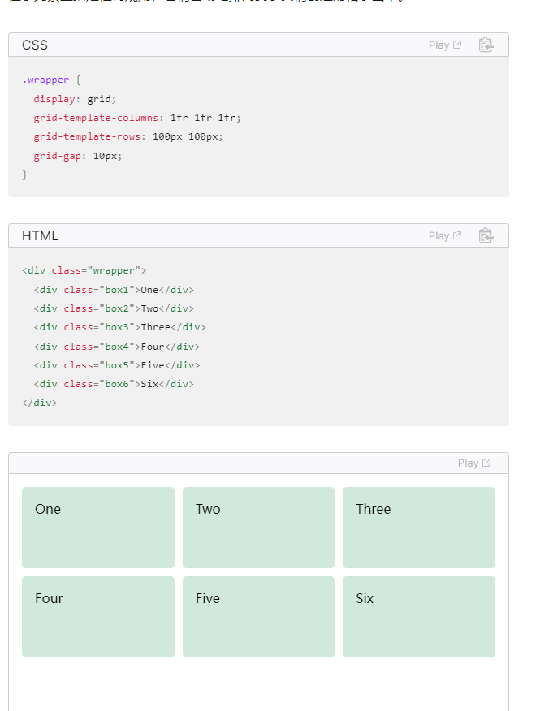
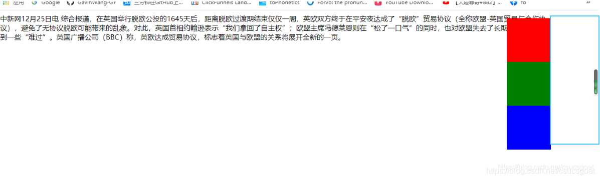
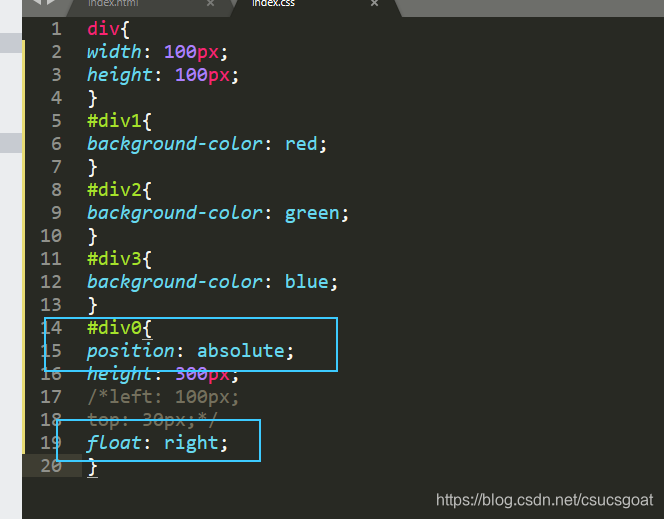
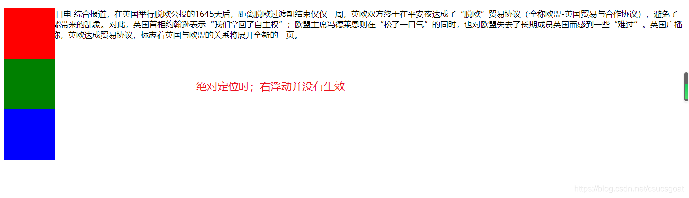

 HTML

[toc]

# 简介

## 网页组成介绍

一个网页要有

```html
<!DOCTYPE html>
<html lang="en">   
	<head>
	<meta charset="UTF-8">
	<meta name="viewport" content="width=device-width, initial-scale=1.0">
    <title>这是标题</title>
    </head>
    
    <body>
        
    </body>
</html>
```

> lang属性指定文档中使用的语言
>
> title是网页标题，应位于head里
>
> meta标签用于说明文档mime类型
>
> charset字符集
>
> \<!DOCTYPE>语句用于说明文档使用的是什么版本
> html、head、body是一对用于描述文档的基本结构

**双标记是前\<x>后\</x>标记的，单标记是\<x>或\<x/>**

**标记里有属性，属性值是由“”包着。但是布尔特征的属性只需要写出这个属性名字就好，无需属性值**

注释：

```html
<!--  注释内容-->
```

## 核心属性

- id

  > **必须以字母开头（A—Z或a—z）。之后可接任意数量的字母、数字（0—9）、以及英文的特殊符号有横线（—）、下划线（）、分号（；）以及句号（.）。（不能以数字、横线、下划线、分号或句号开头）**
  >
  > 必须保持唯一性。**同一HTML页面中不允许存在两个取值相同的id特性**。这种情况下应该由class特性处理。

  ```html
  <p id="p009_-;.">
      p的内容
  </p>
  ```

- class

  > 可以使用class特性指定某元素属于某一特定“类型”（class）。例如，有一个包含了很多段落的文档，其中一部分段落包含对关键点的总结，这种情况下可以通过给相关段落加上值为summary的class 特性以与文档中的其他段落相区分。
  >
  > <p class="summary">Summary goes here</p>
  >
  > 这种用法在CSS中运用非常普遍。class特性的语法如下：class="className"
  >
  > **class 特性的取值还可以是以空格分隔**的class名称列表，例如：class="classNamel className2 className3"

- title

  > title 特性为元素提供可供参考的标题。title特性的语法如下：title="string"
  >
  > title 特性的行为取决于包含它的元素。不过它经常会作为提示标签或在元素载入时显示。并不是每一个“可以”包含title特性的元素都实际上需要。所以当遇到一个特别受益于使用该特性的元素时，你会在该元素中看到它的行为。

- （4）style 特性

  > style 特性可以在元素内部指定CSS规则。下面给出一个如何使用它的例子：
  >
  > 不过，作为总体规则，最好避免使用这个特性。如果想使用CSS规则控制元素的显示方式，最好使用一种独立的样式表取而代之。该特性仍然常用的唯一情况是当它由JavaScript进行设置时。

  ```html
  <p style="font-family:arial;color:#Fc00f000;">Some text.</p>
  ```

  > 指定颜色需要用“color;”，其中可以用英文单词red等


## 编码问题

- 　使用Windows记事本新建的文件，默认字符集是：ANSI，另存为UTF-8格式，其实际格式为带有BOM的utf-8，并不是我们平常开发是指定的（真正意义上的）utf-8！

-  vscode里的charset="UTF-8"是让浏览器要用utf-8来解释，而文档的编码格式，是保存时的选择决定的。

- HTML的编码格式不是utf-8却让浏览器以utf-8的格式进行解析，自然会乱码

  > **当在vscode上，原本的文字是正常显示，但是更换编码后是乱码，只需要撤回既可以又更改编码又变会正常显示。一旦vscode里显示都是乱码，那么浏览器怎么都是乱码**

- 遇到浏览器乱码情况：
  - 用notepad++或记事本转换原编码为别的
  - edge搜索Internet explorer，用老浏览器更换浏览器编码（治标不治本）
  - edge扩展搜索chart插件进行编码转换

# 标签列表

文本

| 标签                 | 标签内的控件                     | 描述                                 | 单双标签 |
| -------------------- | -------------------------------- | ------------------------------------ | :------- |
| \<!--...-->          |                                  | 注释                                 | 单       |
| \<!TYPEDOC html>     |                                  | 定义文档类型                         | 单       |
| \<b>                 |                                  | 粗体                                 | 双       |
| \<big>               |                                  | 大号文本                             | 双       |
| **\<br />**          |                                  | **分行，中间没有空行，与p区分**      | **单**   |
| \<center>            |                                  | 居中文本                             | 双       |
| \<cite>              |                                  | 应用                                 | 双       |
| \<em>                |                                  | 强调文本                             | 双       |
| **\<hr>**            |                                  | 水平线                               | 双       |
| **\**          |                                  | 图像                                 | 单       |
| \<ins>               |                                  | 下划线                               | 双       |
| **\<ul>**            |                                  | 无序列表标记符                       | 双       |
|                      | **\<li>**                        | 有序、无序列表的每一行               | 双       |
| **\<ol>**            |                                  | 有序列表标记符                       | 双       |
|                      | \<li>                            | 有序、无序列表的每一行               | 双       |
| **\<p>**             |                                  | 空行段落                             | 双       |
| \<sub>               |                                  | 下标                                 | 双       |
| \<sup>               |                                  | 上标                                 | 双       |
| \<title>             |                                  | 网页标题                             | 双       |
| \<h1> to \<h6>       |                                  | html标题，会有自动换行               | 双       |
| \<i>                 |                                  | 斜体                                 | 双       |
| \<pre>               |                                  | 预处理，按原格式显示                 | 双       |
| \<del>               |                                  | 删除线                               | 双       |
| **\&nbsp;**          |                                  | 空格                                 | 单       |
| \&ensp;              |                                  | 另一种空格                           | 单       |
| **2.表格**           |                                  |                                      |          |
| **\<table>**         |                                  | **定义表格标记符**                   | **双**   |
|                      | **\<tr>**                        | **表格内一行**                       | 双       |
|                      | **\<th>**                        | **一格（一列），加粗（标题单元格）** | **双**   |
|                      | **\<td>**                        | **一格（一列）,位于tr之内**          | **双**   |
|                      | **\<caption>**                   | 表格标题                             | 双       |
|                      |                                  |                                      |          |
| **3.多媒体**         |                                  |                                      |          |
| \<nav>               |                                  | 包起一堆的链接，一般作为导航块       | 双       |
|                      | <a>                              | 超链接,href=                         | 双       |
| **\<image>**         |                                  | 图片                                 | **单**   |
| \<video>             |                                  | 视频                                 | 双       |
| \<audio>             |                                  | 音频                                 | 双       |
| \<figure>            |                                  |                                      |          |
| \<figcaption>        |                                  |                                      |          |
| \<footer>            |                                  | 尾部标签                             |          |
|                      |                                  |                                      |          |
| **4.表单**           |                                  |                                      |          |
| **\<form>**          |                                  | 表单定义                             | 双       |
|                      | \<textarea>                      | 多行文本                             | 双       |
|                      | \<select>                        | 下拉选择列表                         | 双       |
|                      |                                  | \<option>                            | 双       |
|                      | \<datalist>                      | 下拉选择列表2                        | 双       |
|                      | \<fieldset>                      | 控件组                               | 双       |
| **\<input/>**        | type=text\|botton\|password\|... | 控件                                 | 单       |
|                      |                                  |                                      |          |
| **5.无语义容器元素** |                                  |                                      |          |
| **\<span>**          |                                  |                                      |          |
| **\<div>**           |                                  |                                      |          |
| **\<section>**       |                                  |                                      |          |
| **\<figure>**        |                                  |                                      |          |


# 列表

## 有序列表

- 属性

  - start设置起始数字

  - reversed翻转列表序号

  - type指定序列序号

    | type的属性值 | 描述               |
    | ------------ | ------------------ |
    | 1            | 数字               |
    | a、A         | 小写、大写字母     |
    | i、I         | 小写、大写罗马字母 |

    ```html
    <ol start="II" reversed type="I">
        <li></li>
        <li></li>
    </ol>
    ```


## 无序列表

```html
<ul>
    <li></li>
 	<li></li>   
</ul>
```


# 表格

| **\<table>**                                          | **定义表格标记符**                                 | **双**                                                      |
| ----------------------------------------------------- | -------------------------------------------------- | ----------------------------------------------------------- |
| **border**                                            | **table的属性，表边框大小，不加可以显示不出边框**  | **border="1"**                                              |
| **\<tr>**                                             | **表格内一行**                                     | **双**                                                      |
| **\<th>**  (table **head**)                           | **一格，加粗**                                     | **双**                                                      |
| **\<td>**  (table **data**)                           | **一行中的一格,位于tr之内**                        | **双**                                                      |
| 上面两个两个都可以接colspan和rowspan属性，\<tr>就不行 | 用于表合并单元格，合并后，可以少定义这合并的单元格 | <th colspan="2"></th>      与         <td rowspan="2"></td> |
| **\<caption>**                                        | 表格标题                                           | **双**                                                      |

> **tr是table row**
>
> **th是table heading的缩写**
>
> **td是table data**

```html
<table border="1">
	<tr>
		<th>这是加粗单元格</th>
		<td>单元格</td>
		<td>单元格</td>
	</tr>
		
	<tr>
		<th colspan="2">粗体并且占两列</th>
		<td>因为th占了两列，所以只需要一列了</td>
	</tr>
	
	<tr>
		<td rowspan="2">占两行的单元格</td>
		<td></td>
		<td></td>
	</tr>
    
	<tr>
		<td></td>
		<td></td>
	</tr>
</table>
```


# 多媒体

## 超链接

```html
<a href="http://www.baidu.com">百度链接</a>  #正常链接外部文件

<a name="baidu"></a>
<a href="#baidu"></a>  <!--链接到上面name定义的地方，叫做锚定义-->

<!--base元素为一个页面指定基础URL地址，相当于默认地址吧？-->
<base href="http://" />
--然后就可以
<a href="www.baidu.com/"></a>

<!--a的accesskey特征：创建键盘激活链接的快捷方式，需要用户同时按下ALt或Ctrl等定义的键时，才会被激活-->

<!--target特征：可以赋值“_blank"实现新窗口打开链接-->
<a href="http://www.baidu.com" target="_blank">链接文本</a>
```

> **\<nav>\</nav>双标签会可以指定一块标签的区域，一行表示。一般用于目录**

> title属性作为提示

## 图像

> 

- 以上src是source的缩写，表示文件来源。
- alt是图片的描述文本，当图片不存在时，会显示该文字
- 图像的高和宽可以设置多少像素或是占网页的多少百分比

## 视频

\<video src=".mp4" autoplay controls muted></video>

属性有：

- autoplay：自动播放
- controls：底下控制条
- height
- width
- muted:静音
- src

## 音频

\<audio src=".mp3" muted controls>\</audio>

属性有：

- autoplay：自动播放

- controls：底下控制条

- muted:静音

- src

  > 注：音频不能指定高度和宽度

## 媒介分组

> figure
>
> 标题figcaption

# 表单

> 双标签\<form>\</form>
>
> 每个表单至少一个带action和method两个属性

属性有：

- action
- method
- enctype
- novalidate
- target
- autocomplete
- accept-charset

1. **action属性**

> **action属性指明表单提交后对数据的处理。通常action的属性值是页面或程序，位于接收信息的Web服务器上**

```html
<form action="http://www.example.org/membership/login.aspx">
   
</form>
```

2. **method属性**

**表单数据可以通过两种方式发送给服务器**

- **get方法，将数据作为URL的一部分发送。默认为get**
- **post方法，将数据隐藏在http头中**

## 控件\<input>

> input为单标签
>
> **input的属性**
>
> | 属性      | 属性值         | 描述                                                         |
> | --------- | -------------- | ------------------------------------------------------------ |
> | **type**  | **text**       | 单行文本框                                                   |
> |           | **password**   | 密码框，密码看不见                                           |
> |           | **radio**      | 单选按钮，name相同的为一组，有n个name的值可以选n个单选。**选项的文字在<>外** |
> |           | **checkbox**   | 多选框，多选，同上                                           |
> |           | **submit**     | 提交按钮，单击后把信息提交到服务器                           |
> |           | **reset**      | 重设按钮，单击后清空                                         |
> |           | **button**     | 创建一个按钮，类似submit提交                                 |
> |           | **file**       | 文件域                                                       |
> |           | hidden         | 隐藏文本域，类似于text，但不可见，常用于来传递信息           |
> |           | url            | 网页地址，只有http://*才能输进去                             |
> |           | email          | 只能输邮箱，只有*@+不是符号的字符                            |
> |           | date           | 选年份、月份、日期                                           |
> |           | time           | 选时间，24小时制                                             |
> |           | month          | 选年份、月份                                                 |
> |           | week           | 选年份、当年的第几周                                         |
> |           | datetime       | 日期时间型输入框                                             |
> |           | datetime-local | 选年份、月份、日期、24小时时间                               |
> |           | range          | 数字滑动条                                                   |
> |           | number         | 输入闭区间的数字，也可以上下箭头调大小，min，max，step       |
> |           | color          | 选择颜色                                                     |
> | **name**  |                | 控件名字，可以**用于区分不同的选项集合**                     |
> | size      |                | 文本框的这个框的长度                                         |
> | maxlength |                | 可以输入的最大字符                                           |
> | value     |                | 对于**单行文本框**，表示文本框的默认值，可以修改的。                                   对于**单选按钮或复选框**，则指定其被选中后传送到服务器的实际值。                对于**按钮**，则为按钮上的文本 |
> | checked   | checked        | 布尔型，有这个属性就表示真                                   |
>
> 

### 文本输入控件

- 单行文本输入控件，称为“文本框”。**type="text"**

- 密码输入控件：输入的字符屏幕看不见。**type="password"**

- 多行文本控件：\<textarea>

  | type=text或password | 属性                     | 作用                                                         |
  | ------------------- | ------------------------ | ------------------------------------------------------------ |
  |                     | **placeholder**          | 文本输入框的描述，注意区别于value，**此初始值无法删除，只有在输入框为空时才会显示**，并且无法修改 |
  |                     | **required**             | 无属性值，使用后需要用户必须输入内容才能提交                 |
  |                     | autofocus                | 属性值可有可无，自动在该文本框聚焦                           |
  |                     |                          | autofocus\|autofocus=""\|autofocus="autofocus"               |
  |                     | pattern                  | 指定一个正则表达式，用于对字符值的检查                       |
  |                     | pattern="[0-9]"[a-z]{3}" | 表示必须是以一个数字[0-9]后跟三个小写字母[a-z]开头，后面的则随意 |
  |                     | pattern="[a-zA-Z]{2,3}"  | 表示2-3位字母，应该是闭区间                                  |
  
  ```html
  <form action="http://www.example.org/membership/login.aspx" method="get" name="formsearch">
  	login:
  	<input type="text" name="txtlogin" value="input your login" size="20" maxlength="64">
      <p></p>
  	password:
  	<input type="password" name="txtpassword" placeholder="input your password" size="20" maxlength="64">
  	<input type="submit" value="submit">
  </form>
  ```
  
  > **\<textarea>为双标签**，包在里面的是提示信息，可以删除
  
  | \<textarea> | 属性            | 作用                                                         |
  | ----------- | --------------- | ------------------------------------------------------------ |
  |             | rows            | 指定\<textarea>应该具有的文本行数，因此对应文本的高度        |
  |             | cols            | 指定文本列数，对应输入框的宽度                               |
  |             | **placeholder** | 文本输入框的描述，注意区别于value，**此初始值无法删除，只有在输入框为空时才会显示**，并且无法修改 |

```html
以下是多行文本：<br/>
<textarea name="textarea" rows="20" cols="50">enter your feedback here!</textarea>
```

### 按钮型

创建按钮的两种方式：

#### input元素

- type="submit | reset | button"

  > submit，创建一个单击时提交表单的按钮
  >
  > reset，创建一个按钮，它能自动**重置表单**控件，将它们设置为页面载入时采用的初始值。按钮文字为“重置”
  >
  > button，创建一个用于在用户单击时触发客户端脚本的按钮

  | 属性  |
  | :---: |
  | type  |
  | name  |
  | value |

  ```html
  <input type="submit" value="log in">
  下面是type=reset和button<br>
  <p><input type="reset" placeholder="123"></p>
  <p><input type="button" placeholder="1000"></p>
  ```

- type="image"

  > 此时是一个图片型的type=submit的按钮

  |  属性  |
  | :----: |
  |  src   |
  |  alt   |
  | height |
  | width  |

  ```html
  <input type="image" src="11.jpg" alt="图片错误" height="1" width="2">
  ```

#### \<button>元素

> 双标签
>
> **button元素可以直接代替input，也和input一致，需要设置type**
>
> 注：只要是双标签就可以在双标签内输入文字作为显示

```html
<button type="submit">Submit</button><p>
<button type="reset">clear this form</button>
<button type="button">按钮</button>
```

### 复选框

> 多选框
>
> 开或是关，实现类似多选
>
> 实现：设置input的type="checkbox"
>
> 若要显示文字，需要在<input>外

```html
<input type="radio" name="radio">first
<input type="radio" name="radio">t
```

### 单选按钮

> type=“radio”
>
> 类似单选，但是必须name相同才能单选，否则是多选且选了无法取消
>
> 属性同上

### 文件选择框

> type="file"
>
> 在使用**文件选择框时，form元素的method必须是post**
>
> enctype 特性被加入到＜form＞元素中，值为multipart／form-data，因此每一个表单控件会被单 独发送至服务器。**在使用文件选择框的表单中要求必须这么做**。
>
> accept 特性被加入到＜input＞元素中，以指定可被选择上传文件的MIME类型。在本例中，accept特性指定任何图片格式都可被上传，因为在MIME类型“image／”后使用了通配符（星号）。

```html
<form action="http://www.example.com/imageUpload.aspx" method="post" name="fromImageUpload" enctype="multipart/form-data">
<input type="file" name="fileUpload" accept="image/*"> 
<p><input type="submit"value="Submit"></p>
</form>
```

## 控件\<textarea>

> 双标签，在文本输入控件里查看

## 控件\<select>

> **下拉选择框**

需要使用\<select>元素包住，其中**每一选项用\<option>元素**包含

> 两个都是双标签
>
> **一个select至少包含一个option**

| 元素      | 属性      | 作用                                                         |
| --------- | --------- | ------------------------------------------------------------ |
| \<select> | name      |                                                              |
|           | size      | 值为列表中同时可见的行数，若实际长度超过size，则有个下拉条   |
|           | multiple  | 使用户可以选择多个条目，需要用ctrl键。默认没有，此时用户只能选择一个条目 |
| \<option> | value     |                                                              |
|           | **lable** | **当有lable属性有值时，lable的值的显示大于option双标签包起来的值** |
|           | selected  | 这个布尔特征所在的选项作为初始选择值。该属性可以同时用于多个option,若有多个selected，则按最后一个来算 |

```html
<select name="select" size="100">
    <option selected>select color</option>
    <option>red</option>
    <option>yellow</option>
    <option>green</option>
</select>
```

## 控件\<datalist>

> 选择列表，类似于select，用法注意和select区分

需要使用\<datalist>元素保住，其中每一选项用\<option />

> 一个datalist至少包含一个option
>
> **使用datalist必须要有的input，且input里的list属性的属性名要和datalist的id属性的值一样**
>
> \<option>里的**label**属性要为设置为列表项的**标记**，\<option>里的**value**属性要设置为列表项的**取值**

| 元素        | 属性  | 作用                                               |
| ----------- | ----- | -------------------------------------------------- |
| \<datalist> | id    | 用于建立一个列表选择框，给input的list指定          |
| \<input>    | list  | **list的属性值指向定义好的datalist选择列表的id名** |
| \<option /> | value | 列表项的**取值**                                   |
|             | lable | 列表项的**标记**，标记位于取值的下面，字体相对较小 |

```html
<form>
	Webpage: <input type="url" list="url_list" name="link" />
	<datalist id="url_list">
        <option label="W3School" value="http://www.W3School.com.cn" />
        <option label="Google" value="http://www.google.com" />
        <option label="Microsoft" value="http://www.microsoft.com" />
	</datalist>
</form>
```

>  select与datalist的区别：
>
> - select是label ＞ 外面的显示
> - datalist是value > label > 外面的值（不会显示)

## 控件组\<fieldset>

> 该标签用于对同一表单中的内容进行分组，也可以将网页上的不同表单进行分组
>
> 该标记会在这组内容的周围生成边框线
>
> l**egend是定义该标签内的标题**，类似于caption

```html
<fieldset>
    <legend>用户登录</legend><br/>
	用户名：<input type="text" name="uname" autofocus/>
	<br /><br />
	密&nbsp;码：<input type="password" name="upass" autofocus />
	<br /><br />
	<input type="submit" value="提交"/>
</fieldset>
```


# css

## 选择器

### id选择器

> 对有id名的标记添加样式时，使用的是：**[标记名]#id名**{...}
>
> 其中**一个标记只能定义一个id名**

```html
<head>
    <style>
        p#定义的id名{
            ...
        }
        
        #定义的id名{
            ...
        }
        
     </style>
</head>
<body>
    <p id="定义的id名">
        111
    </p>
</body>
```

> 其中**标记（属性）名可以省略**

### class选择器

> 对有class名的标记添加样式时，使用的是：**[标记名].class名**{...}
>
> **其中一个标记可以定义多个class名，多个用空格作为分隔符分开**

```html
<head>
    <style>  
        p.定义的class名{
            ...
        }
        
        .定义的class名{
            ...
        }
        
     </style>
</head>
<body>
    <p class="定义的id名">
        111
    </p>
</body>
```

>  其中标记名可以省略

- id选择器与class选择器的区别：

  - **id用#，class用.**
  - **class可以定义多个，id不行**
  - 当id选择器与class选择题同时对一个进行样式时，**id选择器＞class选择器的执行**

**组合选择器**

> **使用时，需要父类放左侧，子类放右侧**

### 后代元素选择器

```html
<head>
    <style>
        ol li b{属性1:值1;
                属性2值2；
                属性3值3；
                ...}
     </style>
</head>
```

> 多个标签用' '空格分割。
>
> 表示在ol标签下的li里的b全部生效，只需要li与b是在ol里面，即li和o是在ol内的即可
>
> 即li b只需在ol后就能生效
>
> - **元素2 可以是儿子，也可以是孙子等，只要是元素1 的后代即可**
> - **元素1 和 元素2 可以是任意基础选择器**

### 子元素选择器

```html
<head>
    <style>
        ol>li>b{属性1:值1;
                属性2值2；
                属性3值3；
                ...}
     </style>
</head>
```

> 多个标签用'>'分割。
>
> 表示li必须是ol的直接子项，b必须是li的直接子项时才能生效。中间若有其他的阻挡，则无效
>
> 即li b必须是ol的子元素才能生效
>
> - **元素1 是父级，元素2 是子级，最终选择的是元素2**
> - **元素2 必须是亲儿子，其孙子、重孙之类都不归他管. 你也可以叫他 亲儿子选择器**

### 相邻兄弟选择器

```html
<head>
    <style>
        h1+p{}
    </style>
</head>
```

> 只匹配h1后面紧接着出现的p，**且二者具有相同的父亲元素**
>
> 当两个兄弟元素相同时，会对两个都分别判断符不符合条件，且对后一个元素生效，即最少要两个元素，必须不生效第一个元素
>
> - **可以称之为选后一位兄弟选择器**

### 一般兄弟选择器

```html
<head>
    <style>
        h1~p{}
    </style>
</head>
```

> 表示匹配h1后面所有出现的p，及时中间有别的也没事，**且二者具有相同的父亲元素**
>
> - **可以称之为选一位兄弟选择器**

### 伪类选择器

>  伪类选择器是已经定义好的，不能随便用

| 选择器                            | 说明                                             | 示例                      |
| --------------------------------- | ------------------------------------------------ | ------------------------- |
| E:link                            | 匹配未被点击的E元素                              | a:link{color:brown;}      |
| **E:hover**                       | **匹配鼠标悬停其上的E元素**                      | **a:hover{color:brown;}** |
| a:visited                         | 点击过的(访问过的)链接                           |                           |
| a:active                          | 鼠标正在按下还没有弹起鼠标的那个链接             |                           |
| **E:focus**                       | 表示聚焦于该属性时，发生的动作                   |                           |
| **E:nth-child(n\|even\|odd\|2n)** | **分别表示E的第n个\|偶数个\|奇数个\|偶数个生效** | 可以3n等各种情况          |

> E表示任意标签
>
> 为了确保生效，请按照 LVHA 的循顺序声明 :link－:visited－:hover－:active。

## 使用方法

### 行内样式

> 直接在标签里添加全局的style属性，只在该标签内生效
>
> style="属性名1:属性值1;..."
>
> **引号单内容就是css里花括号{}单内容**

```html
<p style="color:red">
    只用行内标签的style是属性，其他的都是用style标签
</p>
```

### 内部样式表

> 对于使用定义的该标签的位置，都会依次变成设置那样

```html
<head>
    <style>
        p,h1,br{属性1:值1;
                属性2值2；
                属性3值3；
                ...}
     </style>
</head>
```

> 多个属性用'；'分割，只有一个属性可以不用';'
>
> 属性/值对 称为声明
>
> 定义css规则需要位于style标签内，且一般style标签位于头标签内

### ３）链入外部样式表（常用）

> 要将需要链入的外部样式后缀设置为css（文本样式表）

```html
<head>
    <link href="样式表路径" rel="stylesheet" type="text/css" />
</head>
```

> rel用来指定文档与链接文档间的关系，用于链接样式表的键值为"stylesheet"
>
> type用来指定文件类型，这里是指文件的类型时样式表文本

### 导入外部样式表（不常用）

> 导入外部样式表是指在HTML 文件头部的＜style＞元素里导入外部样式表，导入外部样式表采用import方式。**导入外部样式表和链入样式表相似，但导入外部样式表的样式实质上相当于存放在网页内部。而链入外部样式表更像是超链接。**
>
> 当两个以上文档需要使用样式表时，一个使用外部样式表

```html
<head>
    <style type="text/css">
    	@import url("样式表路径");
    </style>
</head>
```

> 注意加顿号；
>
> import的多种写法：
>
> - @import url("样式表路径");
> - @import url(样式表路径);
> - @import "样式表路径";
> - @import '样式表路径';

## 常用css属性表

| 类型       | 属性名                    | 属性值                                         | 描述                                                         | 使用                  |
| ---------- | ------------------------- | ---------------------------------------------- | ------------------------------------------------------------ | --------------------- |
| 颜色       | **color**                 | **rgb()\|#fff\|hsl()\|transparent**            |                                                              |                       |
| 字体       | font-family               | 宋体...                                        | 字体                                                         |                       |
|            | **font-size**             | 长度\|相对尺寸\|百分比\|smaller\|larger [/npx] | 大小,[/npx]可以设置行高                                      | {font-size:20px/15px} |
|            | **font-weight**           | normal\|bold\|100-900\|bolder\|lighter         | 粗细                                                         |                       |
|            | font-style                | normal\|italic                                 | 斜体                                                         |                       |
|            | font-variant              | normal\|small-caps                             | 小型大写字母                                                 |                       |
|            | font                      | style variant weight size family               | 复合字体属性                                                 | {font:10px/4px 宋体}  |
| 文本格式化 | line-height               | normal\|长度\|百分比\|数值                     | 行高调整                                                     |                       |
|            | **text-align**            | center\|left\|right\|justify                   | 文本的对齐                                                   |                       |
|            | **text-indent**           | 长度值\|百分比                                 | 文本缩进,em表示缩进n个字体高                                 | text-indent:2em       |
|            | letter-spacing            |                                                | 字符间距                                                     |                       |
|            | word-spacing              |                                                | 单词间距，对中文无效                                         |                       |
|            | text-decoration           |                                                | 以下三个的合并                                               |                       |
|            | **text-decoration-line**  | **none**\|underline\|overline\|line-through    | 指定文本装饰线的位置与种类，可以用于去除超链接下划线         | text-decoration:none; |
|            | text-decoration-style     | solid\|double\|dotted                          | 表示线条形状，实线、双线、点线                               |                       |
|            | **text-decoration-color** |                                                | 指定颜色                                                     |                       |
| 列表       | list-style                |                                                | 复合属性声明列表属性，none时表示列表无标记项                 |                       |
|            | list-style-image          |                                                | 将图片设置为列表标记项                                       |                       |
|            | list-style-type           |                                                | 设置列表项标记类型，none时表示列表无标记项                   |                       |
| 布局       | **display:block**         |                                                | **转换为块元素**                                             |                       |
|            | **display:inline**        |                                                | **转换为行内元素**                                           |                       |
|            | **display:inline-block**  |                                                | **转换为行内块**                                             |                       |
| 背景       | **background-image**      |                                                | **背景图片**                                                 |                       |
|            | **background-color**      |                                                | **背景颜色**                                                 |                       |
| 用户界面   | **cursor**                | default\|pointer\|move\|text\|not-allowed      | **鼠标样式**。默认、小手、移动、文本、禁止                   |                       |
|            | **outline**               | 0\|none\|数字                                  | **轮廓线。给表单**添加 outline: 0; 或者 outline: none; 样式之后，就可以去掉默认的蓝色边框。 |                       |
| 表格       | **border-collapse**       |                                                | 属性值如下：separate：默认值。边框会被分开。；**collapse：将边框会合并为一个单线的边框；**inherit：继承父元素的 border-collapse 属性的值 |                       |

## css基本属性表（全）

| 类别                 | 属性                          | 描述                                                         | 使用                                                         |
| -------------------- | ----------------------------- | ------------------------------------------------------------ | ------------------------------------------------------------ |
| 背景属性(Background) | `background`                  | 在一个声明中定义各种背景属性。                               |                                                              |
|                      | `background-attachment`       | 指定背景图像是在视口中固定还是滚动。                         |                                                              |
|                      | `background-clip `            | 指定背景的绘制区域。                                         |                                                              |
|                      | `background-color`            | 定义元素的背景色。                                           |                                                              |
|                      | `background-image`            | 定义元素的背景图像。                                         |                                                              |
|                      | `background-origin `          | 指定背景图像的定位区域。                                     |                                                              |
|                      | `background-position`         | 定义背景图像的原点。                                         |                                                              |
|                      | `background-repeat`           | 指定是否/如何平铺背景图像。                                  |                                                              |
|                      | `background-size `            | 指定背景图像的大小。                                         |                                                              |
| 颜色属性(Color)      | `color`                       | 指定元素文本的颜色。                                         |                                                              |
|                      | `opacity `                    | 指定元素的透明度。                                           |                                                              |
| 尺寸属性(Size)       | `height`                      | 指定元素的高度。                                             |                                                              |
|                      | `max-height`                  | 指定元素的最大高度。                                         |                                                              |
|                      | `max-width`                   | 指定元素的最大宽度。                                         |                                                              |
|                      | `min-height`                  | 指定元素的最小高度。                                         |                                                              |
|                      | `min-width`                   | 指定元素的最小宽度。                                         |                                                              |
|                      | `width`                       | 指定元素的宽度。                                             |                                                              |
| 字体属性(Fonts)      | `font`                        | 字体复合属性,其中最后两个是不可缺少参数，必选                | font:font-style font-varient front-weight font-size font-family; |
|                      | `font-family`                 | 定义元素的字体列表。                                         |                                                              |
|                      | `font-size`                   | 定义文本的字体大小。                                         |                                                              |
|                      | `font-size-adjust `           | 发生字体回退时，保留文本的可读性。                           |                                                              |
|                      | `font-stretch `               | 从字体中选择一个普通的，压缩的或扩展的字体。                 |                                                              |
|                      | `font-style`                  | 定义文本的字体样式。                                         |                                                              |
|                      | `font-variant`                | 指定字体变体。                                               |                                                              |
|                      | `font-weight`                 | 指定文本的字体粗细。                                         |                                                              |
| 边框属性(Border)     | `border`                      | 设置元素边框所有四个侧面的宽度，样式和颜色。                 |                                                              |
|                      | `border-bottom`               | 设置元素底部边框的宽度，样式和颜色。                         |                                                              |
|                      | `border-bottom-color`         | 设置元素底部边框的颜色。                                     |                                                              |
|                      | `border-bottom-left-radius `  | 定义元素的左下边界角的形状。                                 |                                                              |
|                      | `border-bottom-right-radius ` | 定义元素右下边界的形状。                                     |                                                              |
|                      | `border-bottom-style`         | 设置元素底部边框的样式。                                     |                                                              |
|                      | `border-bottom-width`         | 设置元素底部边框的宽度。                                     |                                                              |
|                      | `border-color`                | 设置元素所有四个侧面的边框颜色。                             |                                                              |
|                      | `border-image `               | 指定如何使用图像代替边框样式。                               |                                                              |
|                      | `border-image-outset `        | 指定边框图像区域超出边框超出范围的数量。                     |                                                              |
|                      | `border-image-repeat `        | 指定图像边框应重复，四舍五入还是拉伸。                       |                                                              |
|                      | `border-image-slice `         | 指定图像边框的向内偏移。                                     |                                                              |
|                      | `border-image-source `        | 指定要用作边框的图像的位置。                                 |                                                              |
|                      | `border-image-width `         | 指定图像边框的宽度。                                         |                                                              |
|                      | `border-left`                 | 设置元素左边框的宽度，样式和颜色。                           |                                                              |
|                      | `border-left-color`           | 设置元素的左边框的颜色。                                     |                                                              |
|                      | `border-left-style`           | 设置元素左边框的样式。                                       |                                                              |
|                      | `border-left-width`           | 设置元素左边框的宽度。                                       |                                                              |
|                      | `border-radius `              | 定义元素边界角的形状。                                       |                                                              |
|                      | `border-right`                | 设置元素右边框的宽度，样式和颜色。                           |                                                              |
|                      | `border-right-color`          | 设置元素右边框的颜色。                                       |                                                              |
|                      | `border-right-style`          | 设置元素右边框的样式。                                       |                                                              |
|                      | `border-right-width`          | 设置元素右边框的宽度。                                       |                                                              |
|                      | `border-style`                | 在元素的所有四个面上设置边框的样式。                         |                                                              |
|                      | `border-top`                  | 设置元素顶部边框的宽度，样式和颜色。                         |                                                              |
|                      | `border-top-color`            | 设置元素顶部边框的颜色。                                     |                                                              |
|                      | `border-top-left-radius `     | 定义元素左上角的形状。                                       |                                                              |
|                      | `border-top-right-radius `    | 定义元素的右上边界角的形状。                                 |                                                              |
|                      | `border-top-style`            | 设置元素顶部边框的样式。                                     |                                                              |
|                      | `border-top-width`            | 设置元素顶部边框的宽度。                                     |                                                              |
|                      | `border-width`                | 设置元素所有四个侧面的边框宽度。                             |                                                              |
| 边距属性(Margin)     | `margin`                      | 在元素的所有四个面上设置边距。                               |                                                              |
|                      | `margin-bottom`               | 设置元素的底边距。                                           |                                                              |
|                      | `margin-left`                 | 设置元素的左边距。                                           |                                                              |
|                      | `margin-right`                | 设置元素的右边距。                                           |                                                              |
|                      | `margin-top`                  | 设置元素的上边距。                                           |                                                              |
| 填充属性(Padding)    | `padding`                     | 在元素的所有四个面上设置填充。                               |                                                              |
|                      | `padding-bottom`              | 将填充设置为元素的底侧。                                     |                                                              |
|                      | `padding-left`                | 将填充设置为元素的左侧。                                     |                                                              |
|                      | `padding-right`               | 将填充设置为元素的右侧。                                     |                                                              |
|                      | `padding-top`                 | 将填充设置为元素的顶部。                                     |                                                              |
| 表属性(Table)        | `border-collapse`             | 指定是连接还是分隔表格单元格边界。                           |                                                              |
|                      | `border-spacing`              | 设置相邻表格单元格的边界之间的间距。                         |                                                              |
|                      | `caption-side`                | 指定表格标题的位置。                                         |                                                              |
|                      | `empty-cells`                 | 显示或隐藏空表单元格的边框和背景。                           |                                                              |
|                      | `table-layout`                | 指定表布局算法。                                             |                                                              |
| 文字属性(Text)       | `direction`                   | 定义文本方向/书写方向。                                      |                                                              |
|                      | `tab-size `                   | 指定制表符的长度。                                           |                                                              |
|                      | `text-align`                  | 设置内联内容的水平对齐方式。                                 |                                                              |
|                      | `text-align-last `            | 指定当`text-align`is 时如何对齐块的最后一行或强制换行符之前的行`justify`。 |                                                              |
|                      | `text-decoration`             | 指定添加到文本的装饰。                                       |                                                              |
|                      | `text-decoration-color `      | 指定的颜色`text-decoration-line`。                           |                                                              |
|                      | `text-decoration-line `       | 指定将哪种线条装饰添加到元素。                               |                                                              |
|                      | `text-decoration-style `      | 指定`text-decoration-line`属性指定的线条样式                 |                                                              |
|                      | **`text-indent`**             | **缩进文本的第一行。**                                       |                                                              |
|                      | `text-justify `               | 指定当`text-align`属性设置为时要使用的对正方法`justify`。    |                                                              |
|                      | `text-overflow `              | 指定当文本内容溢出块容器时将如何显示。                       |                                                              |
|                      | `text-shadow `                | 将一个或多个阴影应用于元素的文本内容。                       |                                                              |
|                      | `text-transform`              | 转换文本的大小写。                                           |                                                              |
|                      | **`line-height`**             | **设置文本行之间的高度。**                                   |                                                              |
|                      | **`vertical-align`**          | **设置元素相对于当前文本基线的垂直位置。**                   |                                                              |
|                      | `letter-spacing`              | 设置字母之间的额外间距。                                     |                                                              |
|                      | `word-spacing`                | 设置单词之间的间距。                                         |                                                              |
|                      | `white-space`                 | 指定如何处理元素内的空白。                                   |                                                              |
|                      | `word-break `                 | 指定如何在单词内换行。                                       |                                                              |
|                      | `word-wrap `                  | 指定在内容超出其容器边界时是否中断单词。                     |                                                              |
| 视觉格式布局属性     | `display`                     | 指定元素在屏幕上的显示方式。                                 |                                                              |
|                      | `position`                    | 指定如何定位元素。                                           |                                                              |
|                      | `top`                         | 指定所定位元素的上边缘的位置。                               |                                                              |
|                      | `right`                       | 指定所定位元素的右边缘的位置。                               |                                                              |
|                      | `bottom`                      | 指定所定位元素底边的位置。                                   |                                                              |
|                      | `left`                        | 指定定位元素左边缘的位置。                                   |                                                              |
|                      | `float`                       | 指定一个框是否应该浮动。                                     |                                                              |
|                      | `clear`                       | 指定相对于浮动元素的元素位置。                               |                                                              |
|                      | `z-index`                     | 指定定位元素的分层或堆叠顺序。                               |                                                              |
|                      | `overflow`                    | 指定对溢出元素框的内容的处理。                               |                                                              |
|                      | `overflow-x `                 | 指定当内容超出元素内容区域的宽度时如何管理内容。             |                                                              |
|                      | `overflow-y `                 | 指定当内容超出元素内容区域的高度时如何管理内容。             |                                                              |
|                      | `resize `                     | 指定元素是否可由用户调整大小。                               |                                                              |
|                      | `clip`                        | 定义裁剪区域。                                               |                                                              |
|                      | `visibility`                  | 指定一个元素是否可见。                                       |                                                              |
|                      | `cursor`                      | 指定游标的类型。                                             |                                                              |
|                      | `box-shadow `                 | 将一个或多个阴影应用于元素的框。                             |                                                              |
|                      | `box-sizing `                 | 更改默认的CSS框模型。                                        |                                                              |

## css的背景

通过 CSS 背景属性，可以给页面元素添加背景样式。
背景属性可以设置背景颜色、背景图片、背景平铺、背景图片位置、背景图像固定等。

### 背景颜色

样式名称：

background-color 定义元素的背景颜色

使用方式：

```css
background-color:颜色值;
```

其他说明：

元素背景颜色默认值是 transparent（透明）

### 背景图片

样式名称：

background-image 定义元素的背景图片

使用方式：

```css
background-image:none | url(路径)
```

其他说明：

- 实际开发常见于 logo 或者一些装饰性的小图片或者是超大的背景图片, 优点是非常便于控制位置. (精灵图也是一种运用场景)

- 注意：背景图片后面的地址，千万不要忘记加 URL， 同时里面的路径不要加引号。


### 背景平铺

样式名称：

background-repeat 设置元素背景图像的平铺

使用方式：

```css
background-repeat: repeat | no-repeat | repeat-x | repeat-y
```


### 背景图片位置

样式名称：

background-position 属性可以改变图片在背景中的位置

使用方式：

```css
background-position: top bottom,left,top;
```

> 参数代表的意思是：x 坐标和 y 坐标。 可以使用 方位名词 或者 精确单位


其他说明：

- 参数是方位名词

  > 第一个是水平，第二个是垂直

  如果指定的两个值都是方位名词，则两个值前后顺序无关，比如 left top 和 top left 效果一致

  如果只指定了一个方位名词，另一个值省略，则第二个值默认居中对齐

- 参数是精确单位

  如果参数值是精确坐标，那么第一个肯定是 x 坐标，第二个一定是 y 坐标

  如果只指定一个数值，那该数值一定是 x 坐标，另一个默认垂直居中

- 参数是混合单位

  如果指定的两个值是精确单位和方位名词混合使用，则第一个值是 x 坐标，第二个值是 y 坐标

### 背景图片固定

样式名称：

background-attachment 属性设置背景图像是否固定或者随着页面的其余部分滚动。

使用方式：

```css
background-attachment: scroll | fixed;
```

| 参数   | 作用                   |
| ------ | ---------------------- |
| scroll | 背景图像随对象内容滚动 |
| fixed  | 背景图像固定           |

其他说明：

background-attachment 后期可以制作视差滚动的效果。

### 背景样式合写

> **可以在一个盒子里写多个图片，用逗号，隔开**
>
> background:url(1) no-repeat,url(2) top left;

背景合写样式：

background: 背景颜色 背景图片地址 背景平铺 背景图像滚动 背景图片位置;

使用方式：


### 背景色半透明

CSS3 提供了背景颜色半透明的效果。

使用方式：

```css
background:rgba(0,0,0,0.3);  后面必须4个值
```

- 最后一个参数是 alpha 透明度，取值范围在 0~1之间

- 前面三个参数为颜色，(0,0,0)为黑色
- 我们习惯把 0.3 的 0 省略掉，写为 background: rgba(0, 0, 0, .3);

注意：

**背景半透明是指盒子背景半透明，盒子里面的内容不受影响**
CSS3 新增属性，是 IE9+ 版本浏览器才支持的，但是现在实际开发,我们不太关注兼容性写法了,可以放心使用

### 背景总结


背景位置background-position重点

## 控制继承

- [`inherit`](https://developer.mozilla.org/zh-CN/docs/Web/CSS/inherit)

设置该属性会使子元素属性和父元素相同。实际上，就是“开启继承”。

- [`initial`](https://developer.mozilla.org/zh-CN/docs/Web/CSS/initial)

将应用于选定元素的属性值设置为该属性的[初始值](https://developer.mozilla.org/zh-CN/docs/Web/CSS/initial_value)。

- [`revert` (en-US)](https://developer.mozilla.org/en-US/docs/Web/CSS/revert)

将应用于选定元素的属性值重置为浏览器的默认样式，而不是应用于该属性的默认值。在许多情况下，此值的作用类似于 [`unset`](https://developer.mozilla.org/zh-CN/docs/Web/CSS/unset)。

- [`revert-layer` (en-US)](https://developer.mozilla.org/en-US/docs/Web/CSS/revert-layer)

将应用于选定元素的属性值重置为在上一个[层叠层](https://developer.mozilla.org/zh-CN/docs/Web/CSS/@layer)中建立的值。

- [`unset`](https://developer.mozilla.org/zh-CN/docs/Web/CSS/unset)

将属性重置为自然值，也就是如果属性是自然继承那么就是 `inherit`，否则和 `initial` 一样

```css
body {
  color: green;
}

.my-class-1 a {
  color: inherit;
}

.my-class-2 a {
  color: initial;
}

.my-class-3 a {
  color: unset;
}
<ul>
  <li>Default <a href="#">link</a> color</li>
  <li class="my-class-1">Inherit the <a href="#">link</a> color</li>
  <li class="my-class-2">Reset the <a href="#">link</a> color</li>
  <li class="my-class-3">Unset the <a href="#">link</a> color</li>
</ul>
```

- [重设所有属性值](https://developer.mozilla.org/zh-CN/docs/Learn/CSS/Building_blocks/Cascade_and_inheritance#重设所有属性值)

```css
blockquote {
  background-color: orange;
  border: 2px solid blue;
}

.fix-this {
  all: unset;
}
```

### 优先级问题

一个选择器的优先级可以说是由三个不同的值（或分量）相加，可以认为是百（ID）十（类）个（元素）——三位数的三个位数：

- **ID**：选择器中包含 ID 选择器则百位得一分。

- **类**：选择器中包含类选择器、属性选择器或者伪类则十位得一分。

- **元素**：选择器中包含元素、伪元素选择器则个位得一分。

  | 选择器                                    | ID   | 类   | 元素 | 优先级 |
  | :---------------------------------------- | :--- | :--- | :--- | :----- |
  | `h1`                                      | 0    | 0    | 1    | 0-0-1  |
  | `h1 + p::first-letter`                    | 0    | 0    | 3    | 0-0-3  |
  | `li > a[href*="en-US"] > .inline-warning` | 0    | 2    | 2    | 0-2-2  |
  | `#identifier`                             | 1    | 0    | 0    | 1-0-0  |
  | `button:not(#mainBtn, .cta)`              | 1    | 0    | 1    | 1-0-1  |

# 盒子

> 盒子的三要素：边框、外边距及内边距

| 属性        | 描述                                                         |
| ----------- | ------------------------------------------------------------ |
| **border**  | **即使不可见，每个盒子也都有一条边框。边框将一个盒子的边界与周围其他盒子相分离margin** |
| **margin**  | **是从盒子边框到另一个盒子的距离（即外边距）padding**        |
| **padding** | **是元素内容与盒子边框的距离（即内边距）**                   |

如图所示

|                 | margin-top      | margin-top       | margin-top        | margin-top        | margin-top       |                  |
| --------------- | --------------- | ---------------- | ----------------- | ----------------- | ---------------- | ---------------- |
| margin-left     | border-top      | border-top       | **border-top**    | border-top        | border-top       | margin-right     |
| margin-left     | padding-top     | padding-top      | **padding-top**   | padding-top       | padding-top      | margin-right     |
| **margin-left** | **border-left** | **padding-left** | 盒子内容          | **padding-right** | **border-right** | **margin-right** |
| margin-left     | pdding-bottom   | pdding-bottom    | **pdding-bottom** | pdding-bottom     | pdding-bottom    | margin-right     |
| margin-left     | border-bottom   | border-bottom    | **border-bottom** | border-bottom     | border-bottom    | margin-right     |
|                 | margin-top      | margin-top       | **margin-top**    | margin-top        | margin-top       |                  |

## 盒子大小box-sizing

```css
div{width:x px;
height:y px;
box-sizing:content-box|border-box}
```

> 宽高默认设置为内容大小，即**默认值为content-box**
>
> 若使用**border-box则设置盒子的大小**
>
> **其中：盒子的宽度=内容宽度width+padding+margin+border**
>
> **盒子的高度=内容高度height+padding+margin+border**

## 边框样式

| 属性                | 属性值                               | 说明                           | 举例 |
| ------------------- | ------------------------------------ | ------------------------------ | ---- |
| **border-style**    | none\|hidden\|dotted\|dashed\|double | 无边框、隐藏、点状、虚线、实线 |      |
| border-top-style    | 一个属性                             |                                |      |
| border-bottom-style |                                      |                                |      |
| border-left-style   |                                      |                                |      |
| right               |                                      |                                |      |
| **border-width**    | 边框厚度，可以填四个参数             |                                |      |
| top                 |                                      |                                |      |
| bottom              |                                      |                                |      |
| left                |                                      |                                |      |
| right               |                                      |                                |      |
| **border-color**    |                                      |                                |      |
| **复合属性border**  | \[宽度]\[样式]\[颜色]                |                                |      |
| right               |                                      |                                |      |
| left                |                                      |                                |      |
| top                 |                                      |                                |      |
| bottom              |                                      |                                |      |
|                     |                                      |                                |      |
| 内边距padding       |                                      |                                |      |
| right               |                                      |                                |      |
| left                |                                      |                                |      |
| top                 |                                      |                                |      |
| bottom              |                                      |                                |      |
|                     |                                      |                                |      |
| 外边距margin        |                                      |                                |      |
| right               |                                      |                                |      |
| left                |                                      |                                |      |
| top                 |                                      |                                |      |
| bottom              |                                      |                                |      |

> **border-style可以接受四个参数，只有一个表示四边；两个的话，第一个上下，第二个左右；三个的话，第一个上，第二个左右、第三个下；四个的话分表表示上右下左**

## 边框

### 边框的使用


边框样式 **border-style** 可以设置如下值：

- none：没有边框即忽略所有边框的宽度（默认值）
- **solid：边框为单实线(最为常用的)**
- dashed：边框为虚线
- dotted：边框为点线

### 2表格的细线边框

border-collapse 属性控制浏览器绘制表格边框的方式。它控制相邻单元格的边框。

语法：

``` css
 border-collapse:collapse; 
```

collapse 单词是合并的意思

border-collapse: collapse; 表示相邻边框合并在一起

> 3边框会影响盒子实际大小
>
> 边框会额外增加盒子的实际大小。因此我们有两种方案解决：
>
> 测量盒子大小的时候,不量边框。
> 如果测量的时候包含了边框,则需要 width/height 减去边框宽度

### 3圆角边框

在 CSS3 中，新增了圆角边框样式，这样我们的盒子就可以变圆角了。

border-radius 属性用于设置元素的外边框圆角。

语法：

```css
border-radius:length;
```

- 参数值可以为数值或百分比的形式
- 如果是正方形，想要设置为一个圆，把数值修改为高度或者宽度的一半即可，或者直接写为 50%
- 该属性是一个简写属性，可以跟四个值，分别代表左上角、右上角、右下角、左下角
- 两个值：对角线
- 分开写：border-top-left-radius、border-top-right-radius、border-bottom-right-radius 和border-bottom-left-radius

## 内边距（padding）

### 内边距的使用方式

padding 属性用于设置内边距，即边框与内容之间的距离。

语法：

合写属性：


分写属性：


### 内边距会影响盒子实际大小

当我们给盒子指定 padding 值之后，发生了 2 件事情：

- 内容和边框有了距离，添加了内边距。
- padding影响了盒子实际大小。

内边距对盒子大小的影响：

- 如果盒子已经有了宽度和高度，此时再指定内边框，会撑大盒子。
- 如何盒子本身没有指定width/height属性, 则此时padding不会撑开盒子大小。

解决方案：

- 如果保证盒子跟效果图大小保持一致，则让 width/height 减去多出来的内边距大小即可。

## 外边距（margin）

### 外边距的使用方式

margin 属性用于设置外边距，即控制盒子和盒子之间的距离。


### 外边距典型应用

**外边距可以让块级盒子水平居中的两个条件：**

- **盒子必须指定了宽度（width）。**
- **盒子左右的外边距都设置为 auto 。**

常见的写法，以下三种都可以：

```html
margin-left: auto;   margin-right: auto;
margin: auto;
margin: 0 auto;
```

注意：以上方法是让块级元素水平居中，**行内元素或者行内块元素水平居中给其父元素添加 text-align:center 即可。**

### 外边距合并

使用 margin 定义块元素的垂直外边距时，可能会出现外边距的合并。

主要有两种情况:

相邻块元素垂直外边距的合并

当上下相邻的两个块元素（兄弟关系）相遇时，如果上面的元素有下外边距 margin-bottom，下面的元素有上外边距 margin-top ，则他们之间的垂直间距不是 margin-bottom 与 margin-top 之和。取两个值中的较大者这种现象被称为相邻块元素垂直外边距的合并。


解决方案：
**尽量只给一个盒子添加 margin 值。**

嵌套块元素垂直外边距的塌陷

对于两个嵌套关系（父子关系）的块元素，父元素有上外边距同时子元素也有上外边距，此时父元素会塌陷较大的外边距值。


解决方案：

- 可以为父元素定义上边框。
- 可以为父元素定义上内边距。
- 可以为父元素添加 overflow:hidden。

### 清除内外边距

网页元素很多都带有默认的内外边距，而且不同浏览器默认的也不一致。因此我们在布局前，首先要清除下网页元素的内外边距。

```css
*{
    padding:0;   /* 清除内边距 */
    margin:0;    /* 清除外边距 */
}
```

## 盒子样式设置

### 盒子阴影

**box-shadow：后面有5个数值**
 第1个长度值⽤来设置对象的阴影⽔平偏移值。⽔平偏移量正值向， 右负值向左；
 第2个长度值⽤来设置对象的阴影垂直偏移值。垂直偏移量正值向 ，下负值向上；
 第3个长度值则⽤来设置对象的阴影模糊值。模糊度不能为负值；
 第4个长度值则⽤来设置对象的阴影外延值。不允许负值
 第5个是设置对象的阴影的颜⾊


# 盒子布局

布局分为：常规流布局、弹性盒子、网络、浮动、定位、多列布局等

| 布局名称       | 代表                                              |
| -------------- | ------------------------------------------------- |
| 标准（常规）流 | display:block\|inline\|inline-block               |
| 弹性盒子       | display:flex\|inline-flex;  flex:1                |
| 网络grid       |                                                   |
| 浮动           | float:left\|right\|none;  clear:both\|right\|left |
| 定位           | postition:static\|relative\|absolute\|fixed       |
| 多列布局       |                                                   |

所谓的标准流: 就是标签按照规定好默认方式排列

1. 块级元素会独占一行，从上向下顺序排列。

   - 常用元素：div、hr、p、h1~h6、ul、ol、dl、form、table
2. 行内元素会按照顺序，从左到右顺序排列，碰到父元素边缘则自动换行。
   - 常用元素：span、a、i、em 等

以上都是标准流布局，我们前面学习的就是标准流，标准流是最基本的布局方式。

## 网页布局论述

### 什么是元素的显示模式

定义：

元素显示模式就是元素（标签）以什么方式进行显示，比如

自己占一行，比如一行可以放多个 。

作用：

网页的标签非常多，在不同地方会用到不同类型的标签，了解他们的特点可以更好的布局我们的网页。

### 元素显示模式的分类

#### 块元素

常见的块元素：

```html 
<h1>~<h6>、<p>、<div>、<ul>、<ol>、<li>
```

**块级元素的特点**：

- 比较霸道，**自己独占一行。**
- **高度，宽度、外边距以及内边距都可以控制。**
- 宽度默认是容器（父级宽度）的100%。
- 是一个容器及盒子，里面可以放行内或者块级元素。

**注意：**

文字类的元素内不能放块级元素

```html
<p> 标签主要用于存放文字，因此 <p> 里面不能放块级元素，特别是不能放<div> 
同理， <h1>~<h6>等都是文字类块级标签，里面也不能放其他块级元素
```

#### 行内元素

常见的行内元素：

```html
<a>、<strong>、<b>、<em>、<i>、<del>、<s>、<ins>、<u>、<span>
```

> 标签是最典型的行内元素。有的地方也将行内元素称为内联元素。

行内元素的特点：

- 相邻行内元素在一行上，一行可以显示多个。

- **高、宽直接设置是无效的。**
- 默认宽度就是它本身内容的宽度。

- **行内元素只能容纳文本或其他行内元素，而不能放块元素**

注意：
**链接里面不能再放链接**
特殊情况链接 里面可以放块级元素，但是给 转换一下块级模式最安全

#### 行内块元素

常见的行内块标签：

\、\<input />、\<td>

> 它们同时具有块元素和行内元素的特点。有些资料称它们为行内块元素。

行内块元素的特点：

- 和相邻行内元素（行内块）在一行上，但是他们之间会有空白缝隙。
- 一行可以显示多个（行内元素特点）。
- 默认宽度就是它本身内容的宽度（行内元素特点）。
- 高度，行高、外边距以及内边距都可以控制（块级元素特点）。

### 元素显示模式的转换

**简单理解**:

一个模式的元素需要另外一种模式的特性
比如想要增加链接 的触发范围。

**转换方式**

- **转换为块元素：display:block;**
- **转换为行内元素：display:inline;**
- 转换为行内块：display: inline-block;

### 单行文字垂直居中的代码

**解决方案**:

让文字的行高等于盒子的高度 就可以让文字在当前盒子内垂直居中

**简单理解**:

- 行高的上空隙和下空隙把文字挤到中间了，
- 如果行高小于盒子高度,文字会偏上，
- 如果行高大于盒子高度,则文字偏下。


## [display 属性](https://developer.mozilla.org/zh-CN/docs/Learn/CSS/CSS_layout/Introduction#display_属性)

在 css 中实现页面布局的主要方法是设定`display`属性的值。此属性允许我们更改默认的显示方式。正常流中的所有内容都有一个`display`的值，用作元素的默认行为方式。例如，英文段落显示在一个段落的下面，这是因为它们的样式是`display:block`。如果在段落中的某个文本周围创建链接，则该链接将与文本的其余部分保持内联，并且不会打断到新行。这是因为\<a>元素默认为`display:inline`。

你可以更改此默认显示行为。例如，\<li>元素默认为`display:block`，这意味着在我们的英文文档中，列表项显示为一个在另一个之下。如果我们将显示值更改为`inline`，它们现在将显示在彼此旁边，就像单词在句子中所做的那样。事实上，你可以更改任何元素的`display`值，这意味着你可以根据它们的语义选择 html 元素，而不必关心它们的外观。他们的样子是你可以改变的。

除了可以通过将一些内容从`block`转换为`inline`（反之亦然）来更改默认表示形式之外，还有一些更大的布局方法以`display`值开始。但是，在使用这些属性时，通常需要调用其他属性。在讨论布局时，对我们来说最重要的两个值是 `display: flex` 和 `display: grid`。

## [弹性盒子](https://developer.mozilla.org/zh-CN/docs/Learn/CSS/CSS_layout/Introduction#弹性盒子)

> 作用：变成了左浮动且可以自动调宽高的盒子，并且自动调整占满整个父盒子。

Flexbox 是 CSS 弹性盒子布局模块（[Flexible Box Layout](https://developer.mozilla.org/zh-CN/docs/Web/CSS/CSS_flexible_box_layout) Module）的缩写，它被专门设计出来用于创建横向或是纵向的一维页面布局。要使用 flexbox，你只需要在想要进行 flex 布局的父元素上应用`display: flex` ，所有直接子元素都将会按照 flex 进行布局。我们来看一个例子。

### [设置 display:flex](https://developer.mozilla.org/zh-CN/docs/Learn/CSS/CSS_layout/Introduction#设置_displayflex)

现在，当我们把`display: flex`添加到它的父元素时，这三个元素就自动按列进行排列。这是由于它们变成了*flex 项 (flex items)*，按照 flex 容器（也就是它们的父元素）的一些 flex 相关的初值进行 flex 布局：它们整整齐齐排成一行，是因为父元素上`flex-direction`的初值是`row`。它们全都被拉伸至和最高的元素高度相同，是因为父元素上`align-items`属性的初值是`stretch`。这就意味着所有的子元素都会被拉伸到它们的 flex 容器的高度，在这个案例里就是所有 flex 项中最高的一项。所有项目都从容器的开始位置进行排列，排列成一行后，在尾部留下一片空白。

### [设置 flex 属性（充满）](https://developer.mozilla.org/zh-CN/docs/Learn/CSS/CSS_layout/Introduction#设置_flex_属性)

除了上述可以被应用到 flex 容器的属性以外，还有很多属性可以被应用到 flex 项 (flex items) 上面。这些属性可以改变 flex 项在 flex 布局中占用宽/高的方式，允许它们通过伸缩来适应可用空间。

作为一个简单的例子，我们可以在我们的所有子元素上添加[`flex`](https://developer.mozilla.org/zh-CN/docs/Web/CSS/flex) 属性，**并赋值为`1`**，这会使得所有的子元素都伸展并填充容器，而不是在尾部留下空白，如果有更多空间，那么子元素们就会变得更宽，反之，他们就会变得更窄。除此之外，如果你在 HTML 标记中添加了一个新元素，那么它们也会变得更小，来为新元素创造空间——不管怎样，**最终它们会调整自己直到占用相同宽度的空间**。

> 这是一个无单位的比例值，表示每个 flex 项沿主轴的可用空间大小。本例中，我们设置 [``](https://developer.mozilla.org/zh-CN/docs/Web/HTML/Element/article) 元素的 flex 值为 1，这表示每个元素占用空间都是相等的，占用的空间是在设置 padding 和 margin 之后剩余的空间。因为它是一个比例，这意味着将每个 flex 项的设置为 400000 的效果和 1 的时候是完全一样的。

### [列还是行？](https://developer.mozilla.org/zh-CN/docs/Learn/CSS/CSS_layout/Flexbox#列还是行？)

弹性盒子提供了 [`flex-direction`](https://developer.mozilla.org/zh-CN/docs/Web/CSS/flex-direction) 这样一个属性，它可以指定主轴的方向（弹性盒子子类放置的地方）——它**默认值是 `row`**，这使得它们在按你浏览器的默认语言方向排成一排（在英语/中文浏览器中是从左到右）。

> **备注：** 你还可以使用 `row-reverse` 和 `column-reverse` 值反向排列 flex 项。用这些值试试看吧！

### [换行](https://developer.mozilla.org/zh-CN/docs/Learn/CSS/CSS_layout/Flexbox#换行)

> flex-wrap:wrap;

当你在布局中使用定宽或者定高的时候，可能会出现问题即处于容器中的弹性盒子子元素会溢出，破坏了布局。

解决此问题的一种方法是将以下声明添加到 section css 规则中：

```css
flex-wrap:wrap;
同时添加给子块元素
flex:200 px;
```

> 我们现在有多个行。每行都安装了尽可能多的 flex 项。任何溢出都会向下移动到下一行。设置的 `flex：200px` 声明意味着每个声明将至少为 200px 宽。我们稍后会更详细地讨论这个属性。你可能还注意到，最后一行上的最后几个项每个都变得更宽，以便把整个行填满。

### flex-flow复合属性

```css
flex-direction: row;
flex-wrap: wrap;
/*等价于*/
flex-flow: row wrap;
```

### [水平和垂直对齐](https://developer.mozilla.org/zh-CN/docs/Learn/CSS/CSS_layout/Flexbox#水平和垂直对齐)


还可以使用弹性盒子的功能让 flex 项沿主轴或交叉轴对齐

```css
div {
  display: flex;
  align-items: center;
  justify-content: space-around;
}
```


[`align-items`](https://developer.mozilla.org/zh-CN/docs/Web/CSS/align-items) 控制 flex 项在交叉轴上的位置。

- 默认的值是 `stretch`，其会使所有 flex 项沿着交叉轴的方向拉伸以填充父容器。如果父容器在交叉轴方向上没有固定宽度（即高度），则所有 flex 项将变得与最长的 flex 项一样长（即高度保持一致）。我们的第一个例子在默认情况下得到相等的高度的列的原因。
- 在上面规则中我们使用的 `center` 值会使这些项保持其原有的高度，但是会在交叉轴居中。这就是那些按钮垂直居中的原因。
- 你也可以设置诸如 `flex-start` 或 `flex-end` 这样使 flex 项在交叉轴的开始或结束处对齐所有的值。查看 [`align-items`](https://developer.mozilla.org/zh-CN/docs/Web/CSS/align-items) 了解更多。

你可以用 [`align-self`](https://developer.mozilla.org/zh-CN/docs/Web/CSS/align-self) 属性覆盖 [`align-items`](https://developer.mozilla.org/zh-CN/docs/Web/CSS/align-items) 的行为。比如，你可以这样：

```css
button:first-child {
  align-self: flex-end;
}
```


去看看它产生的效果，然后删除它。

[`justify-content`](https://developer.mozilla.org/zh-CN/docs/Web/CSS/justify-content) 控制 flex 项在主轴上的位置。

- 默认值是 `flex-start`，这会使所有 flex 项都位于主轴的开始处。

- 你也可以用 `flex-end` 来让 flex 项到结尾处。

- `center` 在 `justify-content` 里也是可用的，可以让 flex 项在主轴居中。

  > **align-items:center**
  >
  > **＋**
  >
  > **justify-content:center|space-around**
  >
  > **可以让左上角的弹性盒子局水平中垂直中**

- 而我们上面用到的值 `space-around` 是很有用的——它会使所有 flex 项沿着主轴均匀地分布，在任意一端都会留有一点空间。

- 还有一个值是 `space-between`，它和 `space-around` 非常相似，只是它不会在两端留下任何空间。

## Grid 布局

> 可以理解为表格，设置为几行几列，适合盒子里有2*2这种形式
>
> 学习：[CSS Grid 网格布局教程 - 阮一峰的网络日志 (ruanyifeng.com)](http://ruanyifeng.com/blog/2019/03/grid-layout-tutorial.html)

Flexbox 用于设计横向或纵向的布局，而 Grid 布局则被设计用于同时在两个维度上把元素按行和列排列整齐。

### [设置 display: grid](https://developer.mozilla.org/zh-CN/docs/Learn/CSS/CSS_layout/Introduction#设置_display_grid)

同 flex 一样，你可以通过指定 display 的值来转到 grid 布局：`display: grid`。下面的例子使用了与 flex 例子类似的 HTML 标记，描述了一个容器和若干子元素。除了使用`display:grid`，我们还分别使用 [`grid-template-rows`](https://developer.mozilla.org/zh-CN/docs/Web/CSS/grid-template-rows) 和 [`grid-template-columns`](https://developer.mozilla.org/zh-CN/docs/Web/CSS/grid-template-columns) 两个属性定义了一些行和列的轨道。定义了三个`1fr`的列，还有两个`100px`的行之后，无需再在子元素上指定任何规则，它们自动地排列到了我们创建的格子当中。



### 设置网格几行几列

#### grid-template-columns，grid-template-rows 属性

>  `grid-template-columns`属性定义每一列的列宽，`grid-template-rows`属性定义每一行的行高。

```css
.container {
  display: grid;
  grid-template-columns: 100px 100px 100px;
  grid-template-rows: 100px 100px 100px;
}
```

> 其中有多少行多少列，那就写多少个属性，可以用百分比

#### repeat函数

> 有时候，重复写同样的值非常麻烦，尤其网格很多时。这时，可以使用`repeat()`函数，简化重复的值。`repeat()`接受两个参数，第一个参数是重复的次数（上例是3），第二个参数是所要重复的值。
>
> `repeat()`重复某种模式也是可以的。

```css
.container {
  display: grid;
  grid-template-columns: repeat(3, 33.33%);
  grid-template-rows: repeat(3, 33.33%);
}
```

**auto-fill 关键字**

> 有时，单元格的大小是固定的，但是容器的大小不确定。如果希望每一行（或每一列）容纳尽可能多的单元格，这时可以使用`auto-fill`关键字表示自动填充。

```css
.container {
  display: grid;
  grid-template-columns: repeat(auto-fill, 100px);
}
```

> [上面代码](https://jsbin.com/himoku/edit?css,output)表示每列宽度`100px`，然后自动填充，直到容器不能放置更多的列。

#### fr关键字

> 为了方便表示比例关系，网格布局提供了`fr`关键字（fraction 的缩写，意为"片段"）。如果两列的宽度分别为`1fr`和`2fr`，就表示后者是前者的两倍。

```css
.container {
  display: grid;
  grid-template-columns: 1fr 1fr;
}
```

> 上面表示一行分两列，相当于占比的问题

`fr`可以与绝对长度的单位结合使用，这时会非常方便。

```css
.container {
  display: grid;
  grid-template-columns: 150px 1fr 2fr;
}
```

> [上面代码](https://jsbin.com/remowec/edit?html,css,output)表示，第一列的宽度为150像素，第二列的宽度是第三列的一半。

- **minmax()**

`minmax()`函数产生一个长度范围，表示长度就在这个范围之中。它接受两个参数，分别为最小值和最大值。

```css
grid-template-columns: 1fr 1fr minmax(100px, 1fr);
```

> 上面代码中，`minmax(100px, 1fr)`表示列宽不小于`100px`，不大于`1fr`。

#### 布局实例

- **`grid-template-columns`属性对于网页布局非常有用。两栏式布局只需要一行代码。**

> ```css
> .wrapper {
>   display: grid;
>   grid-template-columns: 70% 30%;
> }
> ```

上面代码将左边栏设为70%，右边栏设为30%。

传统的十二网格布局，写起来也很容易。

> ```css
> grid-template-columns: repeat(12, 1fr);
> ```

### 网格其他样式设置

#### 网格列行间距

- `grid-row-gap`属性设置行与行的间隔（行间距），`grid-column-gap`属性设置列与列的间隔（列间距）。

```css
.container {
  grid-row-gap: 20px;
  grid-column-gap: 20px;
}
```

#### 网格单元格对其

- ### justify-items 属性， align-items 属性

  ```css
  .container {
    justify-items: start | end | center | stretch;
    align-items: start | end | center | stretch;
  }
  ```

  > `justify-items`属性设置单元格内容的水平位置（左中右），`align-items`属性设置单元格内容的垂直位置（上中下）。
  >
  > 属性值：
  >
  > - start：对齐单元格的起始边缘。
  > - end：对齐单元格的结束边缘。
  > - center：单元格内部居中。
  > - stretch：拉伸，占满单元格的整个宽度（默认值）。

- ### justify-content 属性， align-content 属性

  ```css
  .container {
    justify-content: start | end | center | stretch | space-around | space-between | space-evenly;
    align-content: start | end | center | stretch | space-around | space-between | space-evenly;  
  }
  ```

  > `justify-content`属性是整个内容区域对于父对象的水平位置（左中右），`align-content`属性是整个内容区域对于父对象的垂直位置（上中下）。

## 浮动

### 设置浮动

为什么需要浮动？

总结： 有很多的布局效果，标准流没有办法完成，此时就可以利用浮动完成布局。 因为浮动可以改变元素标签默认的排列方式.

浮动最典型的应用：可以让多个块级元素一行内排列显示。

网页布局第一准则：多个块级元素纵向排列找标准流，多个块级元素横向排列找浮动。

什么是浮动？

float 属性用于创建浮动框，将其移动到一边，直到左边缘或右边缘触及包含块或另一个浮动框的边缘。

语法：

```css
选择器{float:属性值;}
```

> 如果有两个盒子，只有一个浮动了，那边两个盒子都会在左上角，因为浮动元素脱标了
>
> 可以给一个大盒子设置固定宽高，里面的小盒子全部浮动，这样解决了对齐问题
>
> 如果有两个盒子浮动，那么后一个的浮动会按照第一个盒子来浮动
>
> 如果大盒子满了的话，浮动会跑去下一行。可以应用这个特性，构造固定的n行n列
>
> 一般要浮动都是一个大盒子内的小盒子全部设置浮动的效果


浮动特性

加了浮动之后的元素,会具有很多特性,需要我们掌握的.

- **浮动元素会脱离标准流(脱标：浮动的盒子不再保留原先的位置)**
- 浮动的元素会一行内显示并且元素顶部对齐

>  注意：浮动的元素是互相贴靠在一起的（不会有缝隙），如果父级宽度装不下这些浮动的盒子，多出的盒子会另起一行对齐。


- 浮动的元素会具有行内块元素的特性

**浮动元素的大小根据内容来决定，没法手动调节浮动元素的大小**

浮动的盒子中间是没有缝隙的

浮动元素经常和标准流父级搭配使用

为了约束浮动元素位置, 我们网页布局一般采取的策略是:

先用标准流父元素排列上下位置, 之后内部子元素采取浮动排列左右位置. 符合网页布局第一准侧


常见网页布局

浮动布局注意点

1. 浮动和标准流的父盒子搭配。

先用标准流的父元素排列上下位置, 之后内部子元素采取浮动排列左右位置

1. 一个元素浮动了，理论上其余的兄弟元素也要浮动。

一个盒子里面有多个子盒子，如果其中一个盒子浮动了，其他兄弟也应该浮动，以防止引起问题。

浮动的盒子只会影响浮动盒子后面的标准流,不会影响前面的标准流.

### 清除浮动

为什么需要清除浮动？

由于父级盒子很多情况下，不方便给高度，但是子盒子浮动又不占有位置，最后父级盒子高度为 0 时，就会影响下面的标准流盒子。


清除浮动本质

清除浮动的本质是清除浮动元素造成的影响：浮动的子标签无法撑开父盒子的高度

注意：

- 如果父盒子本身有高度，则不需要清除浮动
- 清除浮动之后，父级就会根据浮动的子盒子自动检测高度。
- 父级有了高度，就不会影响下面的标准流了

清除浮动样式

语法：

```css
选择器{clear:属性值};
```

> 若当前行是浮动行，清除浮动后，该盒子会直接跑去下一行，清除浮动就是回归原始的块级元素


我们实际工作中， 几乎只用 **clear: both;**

清除浮动的策略是: 闭合浮动.

清除浮动的多种方式

#### 额外标签法

额外标签法也称为隔墙法，是 W3C 推荐的做法。

使用方式：

额外标签法会在浮动元素末尾添加一个空的标签。

```html
<div style="clear:both"></div>，或者其他标签（如<br />等）。
```

优点： 通俗易懂，书写方便

缺点： 添加许多无意义的标签，结构化较差

注意： 要求这个新的空标签必须是块级元素。

> 总结:
>
> 清除浮动本质是
>
> 清除浮动的本质是清除浮动元素脱离标准流造成的影响
>
> 清除浮动策略是
>
> 闭合浮动. 只让浮动在父盒子内部影响,不影响父盒子外面的其他盒子.
>
> 额外标签法
>
> 隔墙法, 就是在最后一个浮动的子元素后面添
>
> 加一个额外标签, 添加 清除浮动样式.
>
> 实际工作可能会遇到,但是不常用

#### 父级添加 overflow 属性

可以给父级添加 overflow 属性，将其属性值设置为 hidden、 auto 或 scroll 。

例如：

```css
overflow:hidden | auto | scroll;
```

优点：代码简洁

缺点：无法显示溢出的部分

注意：是给父元素添加代码

#### 父级添加after伪元素

:after 方式是额外标签法的升级版。给父元素添加：

```css
.clearfix:after {  
   content: ""; 
   display: block; 
   height: 0; 
   clear: both; 
   visibility: hidden;  
 } 
 .clearfix {  /* IE6、7 专有 */ 
   *zoom: 1;
 }   
```

优点：没有增加标签，结构更简单

缺点：照顾低版本浏览器

代表网站： 百度、淘宝网、网易等

#### 父级添加双伪元素

给父元素添加

```css
 .clearfix:before,.clearfix:after {   
    content:"";   
    display:table;  
} 
.clearfix:after {   clear:both; } .clearfix {    *zoom:1; }   

```

优点：代码更简洁

缺点：照顾低版本浏览器

代表网站：小米、腾讯等

- 总结

为什么需要清除浮动？

1. 父级没高度。
2. 子盒子浮动了。
3. 影响下面布局了，我们就应该清除浮动了。


## 定位

- 浮动可以让多个块级盒子一行没有缝隙排列显示， 经常用于横向排列盒子。
- 定位则是可以让盒子自由的在某个盒子内移动位置或者固定屏幕中某个位置，并且可以压住其他盒子。

### 定位组成

**定位**：将盒子**定**在某一个位置，所以**定位也是在摆放盒子， 按照定位的方式移动盒子**

定位也是用来布局的，它有两部分组成：

> **定位 = 定位模式 + 边偏移**

定位模式 用于指定一个元素在文档中的定位方式。边偏移则决定了该元素的最终位置。

#### 边偏移（方位名词）

边偏移 就是定位的盒子移动到最终位置。有 top、bottom、left 和 right 4 个属性。

边偏移属性


​		top

​		top: 80px

- 顶端偏移量，定义元素相对于其父元素上边线的距离。

  

​		bottom

​		bottom: 80px

- 底部偏移量，定义元素相对于其父元素下边线的距离。

  

​		left

​		left: 80px

- 左侧偏移量，定义元素相对于其父元素左边线的距离。

  

​		right

​		right: 80px

- 右侧偏移量，定义元素相对于其父元素右边线的距离

定位的盒子有了边偏移才有价值。 一般情况下，凡是有定位地方必定有边偏移。

#### 定位模式 (position)

在 CSS 中，通过 `position` 属性定义元素的**定位模式**，语法如下：

```css
选择器{
    position:属性值;
}
```

定位模式是有不同分类的，在不同情况下，我们用到不同的定位模式。

定位模式决定元素的定位方式 ，它通过 CSS 的 position 属性来设置，其值可以分为四个：

```
static
```

> **静态**定位

```
relative
```

> **相对**定位

```
absolute
```

> **绝对**定位

```
fixed
```

> **固定**定位


### 定位模式介绍

####  静态定位(static) - 了解

- **静态定位**是元素的**默认**定位方式，**无定位的意思**。它相当于 border 里面的none，静态定位static，不要定位的时候用。

语法：position:static

- 静态定位 按照标准流特性摆放位置，它没有边偏移。
- 静态定位在布局时我们几乎不用的

####  相对定位(relative) - 重要

- 相对定位是元素在移动位置的时候，是相对于它自己原来的位置来说的（自恋型）。
- 语法：

选择器 {
position: relative;
}

- **相对定位的特点：（务必记住）**

- 它是相对于自己原来的位置来移动的（移动位置的时候参照点是自己原来的位置）。

  > left：x px其实是指向右移x px。就是需要按照相反方向去移动

- 原来在标准流的位置继续占有，后面的盒子仍然以标准流的方式对待它。因此，相对定位并没有脱标。它最典型的应用是给绝对定位当爹的。。。


####  绝对定位(absolute) - 重要

##### 绝对定位的介绍

- **绝对定位**是元素在移动位置的时候，是相对于它**祖先元素**来说的（拼爹型）。
- 语法： 选择器 {  	position: absolute;  }

1. **完全脱标** —— 完全不占位置；
2. **父元素没有定位**，则以**浏览器**为准定位（Document 文档）。


3. **父元素要有定位**
   - 元素将依据最近的已经定位（绝对、固定或相对定位）的父元素（祖先）进行定位。


- **绝对定位的特点总结：（务必记住）**

如果没有祖先元素或者祖先元素没有定位，则以浏览器为基准定位（Document 文档）。

如果祖先元素有定位（相对、绝对、固定定位），则以最近一级的有定位祖先元素为参考点移动位置。

绝对定位不再占有原先的位置。所以绝对定位是脱离标准流的。（脱标）

**4.绝对定位会把内容区域给占去**

##### 定位口诀 —— 子绝父相

弄清楚这个口诀，就明白了绝对定位和相对定位的使用场景。

这个**“子绝父相”太重要了，是我们学习定位的口诀**，是定位中最常用的一种方式这句话的意思是：子级是绝对定位的话，父级要用相对定位。

因为绝对定位的盒子是拼爹的，所以要和父级搭配一起来使用。

①子级绝对定位，不会占有位置，可以放到父盒子里面的任何一个地方，不会影响其他的兄弟盒子。

②父盒子需要加定位限制子盒子在父盒子内显示。

③父盒子布局时，需要占有位置，因此父亲只能是相对定位。

这就是子绝父相的由来，所以相对定位经常用来作为绝对定位的父级。

总结： **因为父级需要占有位置，因此是相对定位， 子盒子不需要占有位置，则是绝对定位**


####  固定定位(fixed) - 重要

- **固定定位**是元素**固定于浏览器可视区的位置**。（认死理型） 主要使用场景： 可以在浏览器页面滚动时元素的位置不会改变。
- 语法：选择器 {  	position: fixed;  }

- **固定定位的特点：（务必记住）：**

以浏览器的可视窗口为参照点移动元素。

- ​	跟父元素没有任何关系
- ​	不随滚动条滚动。

固定定位不在占有原先的位置。

- 固定定位也是脱标的，其实固定定位也可以看做是一种特殊的绝对定位。（认死理型）

- 完全脱标—— 完全不占位置；
  只认浏览器的可视窗口 —— 浏览器可视窗口 + 边偏移属性 来设置元素的位置；
  跟父元素没有任何关系；单独使用的
  不随滚动条滚动。


### 定位总结

- 一定记住 相对定位、固定定位、绝对定位 两个大的特点： 1. 是否占有位置（脱标否） 2. 以谁为基准点移动位置。

- 学习定位重点学会子绝父相。

- 注意：

  1. 边偏移需要和定位模式联合使用，单独使用无效；

  1. top 和 bottom 不要同时使用；

  1. left 和 right 不要同时使用。

### 定位的应用

####  固定定位小技巧： 固定在版心左侧位置。

小算法：

让固定定位的盒子 left: 50%. 走到浏览器可视区（也可以看做版心） 的一半位置。

让固定定位的盒子 margin-left: 版心宽度的一半距离。 多走 版心宽度的一半位置

就可以让固定定位的盒子贴着版心右侧对齐了。

####  堆叠顺序（z-index）

- 在使用**定位**布局时，可能会**出现盒子重叠的情况**。此时，可以使用 **z-index** 来控制盒子的前后次序 (z轴)

语法：选择器 { 	z-index: 1; }

- z-index 的特性如下：

  

  - 属性值：正整数、负整数或 0，默认值是 0，数值越大，盒子越靠上；
  - 如果属性值相同，则按照书写顺序，后来居上；
  - 数字后面不能加单位。
    注意：z-index 只能应用于相对定位、绝对定位和固定定位的元素，其他标准流、浮动和静态定位无效。

- 应用 z-index 层叠等级属性可以调整盒子的堆叠顺序。如下图所示：


###  定位(position)的拓展

#### 绝对定位的盒子居中

> **注意**：加了**绝对定位/固定定位的盒子**不能通过设置 `margin: auto` 设置**水平居中**。
>
> 但是可以通过以下计算方法实现水平和垂直居中，可以按照下图的方法：


1. `left: 50%;`：让**盒子的左侧**移动到**父级元素的水平中心位置**；
2. `margin-left: -100px;`：让盒子**向左**移动**自身宽度的一半**。


#### 定位特殊特性

绝对定位和固定定位也和浮动类似。

行内元素添加绝对或者固定定位，可以直接设置高度和宽度。

块级元素添加绝对或者固定定位，如果不给宽度或者高度，默认大小是内容的大小。

前面我们讲过， display 是 显示模式， 可以改变显示模式有以下方式:

可以用inline-block 转换为行内块
可以用浮动 float 默认转换为行内块（类似，并不完全一样，因为浮动是脱标的）
绝对定位和固定定位也和浮动类似， 默认转换的特性 转换为行内块。
所以说， 一个行内的盒子，如果加了浮动、固定定位和绝对定位，不用转换，就可以给这个盒子直接设置宽度和高度等。

#### 脱标的盒子不会触发外边距塌陷

浮动元素、**绝对定位(固定定位）**元素的都不会触发外边距合并的问题。 （我们以前是用padding border overflow解决的）

也就是说，我们给盒子改为了浮动或者定位，就不会有垂直外边距合并的问题了。

#### 绝对定位（固定定位）会完全压住盒子

浮动元素不同，只会压住它下面标准流的盒子，但是不会压住下面标准流盒子里面的文字（图片）

但是绝对定位（固定定位） 会压住下面标准流所有的内容。

浮动之所以不会压住文字，因为浮动产生的目的最初是为了做文字环绕效果的。 文字会围绕浮动元素

### 定位和浮动的结合使用

- 只用浮动

  文字会绕着走

- 浮动加相对定位

  

  

- 浮动加绝对定位

  > 此时，浮动会失效不起作用

  

  

## 元素的显示与隐藏

- 目的（本质）

  让一个元素在页面中消失或者显示出来

- 场景

  类似网站广告，当我们点击关闭就不见了，但是我们重新刷新页面，会重新出现！

###  display 显示（重点）

display 设置或检索对象是否及如何显示。

```css
display: none /*隐藏对象display：block 除了转换为块级元素之外，同时还有显示元素的意思。*/
```


特点： display 隐藏元素后，不再占有原来的位置。

后面应用及其广泛，搭配 JS 可以做很多的网页特效。实际开发场景：

> 配合后面js做特效，比如下拉菜单，原先没有，鼠标经过，显示下拉菜单， 应用极为广泛


### 、visibility 可见性 （了解）

- visibility 属性用于指定一个元素应可见还是隐藏。

  ```css
  visibility：visible ; 　元素可视visibility：hidden; 　  元素隐藏
  ```

- 特点：**visibility 隐藏元素后，继续占有原来的位置**。（停职留薪）

- 如果隐藏元素想要原来位置， 就用 visibility：hidden

- 如果隐藏元素不想要原来位置， 就用 display：none (用处更多 重点）

  

### overflow 溢出（重点）

overflow 属性指定了如果内容溢出一个元素的框（超过其指定高度及宽度） 时，会发生什么。

| 属性值  | 描述                                       |
| ------- | ------------------------------------------ |
| visible | 不剪切内容也不添加滚动条                   |
| hidden  | 不显示超过对象尺寸的内容，超出的部分隐藏掉 |
| scroll  | 不管超出内容否，总是显示滚动条             |
| auto    | 超出自动显示滚动条，不超出不显示滚动条     |

一般情况下，我们都不想让溢出的内容显示出来，因为溢出的部分会影响布局。
但是如果有定位的盒子， 请慎用overflow:hidden 因为它会隐藏多余的部分。


- 实际开发场景：

1. 清除浮动
2. 隐藏超出内容，隐藏掉, 不允许内容超过父盒子。


# 网页水平居中与垂直居中

> 水平：
>
> - align-items:center;
> - justify-content:center;
> - justify-items:center;
>
> 垂直：
>
> - vertical-align:middle

## 弹性盒子垂直水平居中的方法

> 主要是靠：
>
> - align-items:center;
> - justify-content:center;
> - justify-items:center;
> - 父浮动，子自动外边距

### 一：

```css
父元素 {
display: grid;
align-items: center;
justify-items: center;
}
```

### 二：

```css
父元素 {
display: grid;
align-items: center;
justify-content: center;
}
```

### 三：

```css
父元素{
display: grid;
}
子元素 {
margin: auto;
}
```

### 四：

```css
父元素 {
display: flex;
align-items: center;
justify-content: center;
}
```

> 水平居中用：justify-content: center;   
>
> 垂直居中用：align-items:center;
>
> 水平垂直居中用上面两个

### 五：

```css
父元素{
display: flex;
}
子元素 {
margin: auto;
}
```

### 六：

```css
父元素 {
display: table-cell;
vertical-align: middle;
text-align: center;
}
子元素 {
display: inline-block;
}
```

### 七：

```css
父元素 {
position: relative;
}
子元素 {
position: absolute;
left: 50%;
top: 50%;
transfrom: translate(-50%, -50%);
margin: 0;
}
```

### 八：

```css
父元素 {
height: xx px;
text-align: center;
}
父元素::after {
content: '';
line-height:xx px;
}
子元素 {
display: inline-block;
}
```

### 九：

```css
.box {
position: relative;
}
p {
/*必须要设置宽高*/
width: 100px;
height: 40px;
position: absolute;
top: 0;
bottom: 0;
left: 0;
right: 0;
margin: auto;
}
```


## 文本在盒子中水平、垂直居中（图片与文本）

> 通过css实现元素的水平居中较为简单：对文本，只需要对其父级元素设置text-align: center;，而对div等块级元素，只需要设置其left和right的margin值为auto。要实现元素的垂直居中，有人会想到css中的vertical-align属性，但是它只对拥有valign特性的元素才生效，例如表格元素中的<td>、<th>、<caption>等，而像<div>、<span>这样的元素是没有valign特性的，因此使用vertical-align对它们不起作用。因此我们需要通过别的去实现元素的垂直居中。

### 单行文本垂直居中

> 对于单行文本，我们只需要将**left和right的margin值为auto或者将文本行高(line-height)和所在区域高度(height)设为一致**即可：

```css
<!--html代码-->
    <div id="div1">
        这是单行文本垂直居中
    </div>
 
/*css代码*/
        /*方式一*/
        #div1{
            width: 300px;
            height: 100px;
            margin: 50px auto;
            border: 1px solid red;
        }
        /*方式二*/
        #div1{
            height: 100px;
            line-height: 100px; /*设置line-height与父级元素的height相等*/
            text-align: center; /*设置文本水平居中*/
            overflow: hidden; /*防止内容超出容器或者产生自动换行*/ 
        }
```

### 多行文本垂直居中

> 多行文本垂直居中分为两种情况，**一个是父级元素高度不固定**，随着内容变化；**另一个是父级元素高度固定**。

#### 1父级元素高度不固定

父级高度不固定的时，高度只能通过内部文本来撑开。这样，我们可以通过设置内填充（padding）的值来使文本看起来垂直居中，只需设置padding-top和padding-bottom的值相等：

```css
<!--html代码-->
    <div id="div1">
            这是多行文本垂直居中，
            这是多行文本垂直居中，
            这是多行文本垂直居中，
            这是多行文本垂直居中。
    </div>
 
/*css代码*/
        #div1{
            width: 300px;
            margin: 50px auto;
            border: 1px solid red;
            text-align: center; /*设置文本水平居中*/
            padding: 50px 20px;/*通过内边距将盒子撑大实现居中*/
        }
```

> 撑大它这里用的是px，应该不能用百分百

#### 2父级元素高度固定

本文一开始就提到css中的**vertical-align属性，但是它只对拥有valign特性的元素才生效**，结合display: table;，可以使得div模拟table属性。因此我们可以**设置父级div的display属性：display: table;然后再添加一个div包含文本内容，设置其display:table-cell;和vertical-align:middle;**。具体代码如下：

```html
<!DOCTYPE html>
<html lang="en">
<head>
    <meta charset="gbk">
    <title>Document</title>
    <style >
        .middle-box{
            display: table; 
            height: 300px;
            width: 400px;
            border: 1px solid red ;
        }
        .middle-inner{
            display: table-cell; 
            vertical-align:middle; 
            /* text-align:center; */
        }
    </style>
</head>
<body>
    <div class="middle-box">
        <div class="middle-inner">
                缺点就是不兼容ie6、ie7缺点就是不兼容ie6、ie7缺点就是不兼容ie6、ie7缺点就是不兼容ie6、ie7缺点就是不兼容ie6、ie7缺点就是不兼容ie6、ie7缺点就是不兼容ie6、ie7缺点就是不兼容ie6、
                ie7缺点就是不兼容ie6、ie7缺点就是不兼容ie6、ie7缺点就是不兼容ie6、ie7缺点就是不兼容ie6、ie7缺点就是不兼容ie6、ie7缺点就是不兼容ie6、ie7缺点就是不兼容ie6、ie7缺点就是不兼容ie6、ie7
        </div>
    </div>
</body>
</html>
 
```

> 注意：虽然display：table解决了避免使用表格的问题，但有几个需要注意的：
>
> （1）**display: table时padding会失效**
> （2）display: table-row时margin、padding同时失效
> （3）**display: table-cell时margin会失效**
> 这是因为IE7及以下的版本并不能很好的支持display:table和display:table-cell属性，当然，如果你不考虑IE7以下的版本的浏览器，上述方法是可以实现垂直居中。如果把IE7及以下版本考虑进去，我们可以通过用到CSS hack的知识来设置针对不同浏览器的属性。

#### 利用line-height和vertical-align：

```css
<!DOCTYPE html>
<html lang="en">
<head>
    <meta charset="utf-8">
    <title>css居中对齐</title>
    <style>  
        *{padding: 0;margin:0;font-size: 12px;}  
        div{
            float: left;
            margin: 20px;
            width: 200px;
            height:200px;
            line-height: 200px;
            border:1px solid #000; 
        }  
        span{
            display: inline-block;
            vertical-align: middle;
            line-height: 22px;
        }
    </style>
    <div>  
        <span>测试文字测试文字</span>  
    </div>  
    <div>  
        <span>测试文字 <br/> 测试文字<br/> 测试文字<br/> 测试文字<br/> 测试文字<br/> 测试文字</span>  
    </div>
</body>
</html>
```

> 父元素line-height为height的值，子元素设置vertical,display:inline-block
>
> 关键样式：
>
> 　　① 父元素（这里是div）设置和高度一致的 line-height （这里是200px）--- 由后面的vertical-align定义看，这是为了设置div的基线
>
> 　　② 子元素 (这里是span) 设置合适的line-height，并设置display:inline-block、vertical-align: middle;  --- inline水平的元素无法设置line-height，所以这里要设置inline-block。
>
> 　　重新审视一下 CSS vertical-align 属性 的定义：
>
> 　　该属性定义行内元素的基线相对于该元素所在行的基线的垂直对齐，允许指定负长度值和百分比值，这会使元素降低而不是升高。在表单元格中，这个属性会设置单元格框中的单元格内容的对齐方式。
>
> 　　有以下几点需要注意：
>
> 　　① vertical-align属性应该设置到 行内元素上（行内块元素也可）
>
> 　　② 如果文字的总高度超出了 容器（这里是div）的高度，那么垂直居中会失效。
>
> 　　③ ie7以下 span结束标签和内部内容不能有间隔空白，也就是说span的结束标签和内部内容要连在一起。

### **图片和文字垂直居中对齐（图片与文字在同一行）**

vertical-align对inline-block最敏感。默认属性是:vertical-align:baseline;

```css
img{
    vertical-align:middle;
}
```

## 盒子居中

特别说明：在元素设置position:absolute;来设置居中效果时，除去博客下介绍的css3方法外，还可以使用负的margin来居中，这样解决了兼容性的问题，但是只适用于宽高已知的情况（因为负的偏移量为元素宽高的一半）。宽高改变时，不再是居中效果。

在这些布局中的子元素，因为其属性设置，都默认为内容宽度。

本文所有居中的例子，只讨论css的实现，html代码统一如下：

### 水平居中

#### 子元素inline-block配合text-align（父元素）

```css
.parent{   
    text-align: center;   
}   
.child{   
    display: inline-block;   
}   
```
> 优点：兼容性非常好，只需要添加只需要在子元素的css中添加*display:inline和*zoom:1就可兼容到IE6、7；
> 缺点：内部文字也会水平居中，需消除影响。

#### table配合margin（子元素）

​    display:table；此元素会作为块级表格来显示（类似 \<table>），表格前后带有换行符。

    .child{   
        display:table;   
        margin: 0 auto;   
    }   
优点：设置特别简单，**只需对子元素进行设置display:table和margin:0**，支持IE8+，需支持IE6，7时，可更换子元素为表格结构。

#### abasolute配合transform

```css
.parent{   
    position:relative;   
}   
.child{   
    position:absolute;   
    left:50%;   
    transform: translateX(-50%);   
}   
```

> 子绝父相配合transform
>
> 优点：居中元素不对其他元素产生影响。缺点：CSS3新属性支持IE9+，低版本浏览器不支持。

#### 定位的盒子水平居中

```css
.child{
  width: 200px;
  height: 200px;
  background: #666;
  position:absolute;
  left: 50%;
  margin-left: 100px;
}
```

> 先左右走父元素盒子的一半50%，在向左走子盒子的一半(margin-left:负值。)（前提宽高已知）

### 垂直居中

#### table-cell配合vertical-align（父元素）

  **display:table-cell;此元素会作为一个表格单元格显示（类似 <td> 和 <th>）**

```css
.parent{   
    display: table-cell;   
    vertical-align:middle;   
} 
```

> **优点：**设置简单，只需对父元素进行设置，兼容到IE8+，需兼容地版本浏览器时，可更换div为表格结构。

#### absolute配合tranform

```css
     .parent{   
        position:relative;   
    }   
    .child{   
        position:absolute;   
        top: 50%;   
        transform: translateY(-50%);   
    }   
```

#### 定位的盒子垂直居中

**先上下拿走父元素盒子的一半50%，在向上走子盒子的一半(margin-left:负值。)（前提宽高已知）**

```css
.child{
  width: 200px;
  height: 200px;
  background: #666;
  position:absolute;
  top: 50%;
  margin-top: 200px;
}
```

### 水平垂直居中（上面两个结合）

#### inline-block配合text-align加上table-cell配合vertical-align

    .parent{   
        display: table-cell;   
        vertical-align:middle;   
        text-align:center;   
    }   
    .child{   
        display: inline-block;   
    }   
> 优点：综合前两中方法，兼容性好！支持IE8+，低版本浏览器也好兼容。缺点：设置较为复杂。

#### absolute配合transform

方式一 


    .parent{   
        position: relative;   
    }   
    .child{   
        position: absolute;   
        left: 50%;   
        top: 50%;   
        transform: translate(-50%,-50%);   
    }   
> 优点：居中元素不对其他元素产生影响。缺点：CSS3新属性支持IE9+，低版本浏览器不支持。 

方式二

    .child{   
        position: absolute;   
        top: 0;
        right: 0;
        bottom: 0;
        left: 0;
        margin: auto;
    }   


# 十css动画@keyframes

## 配置动画时间设置

创建动画序列，需要使用 [`animation`](https://developer.mozilla.org/zh-CN/docs/Web/CSS/animation) 属性或其子属性，该属性允许配置动画时间、时长以及其他动画细节，但该属性不能配置动画的实际表现，动画的实际表现是由 [`@keyframes`](https://developer.mozilla.org/zh-CN/docs/Web/CSS/@keyframes) 规则实现，具体情况参见[使用 keyframes 定义动画序列](https://developer.mozilla.org/zh-CN/docs/Web/CSS/CSS_animations/Using_CSS_animations#使用_keyframes_定义动画序列)小节部分。

[`animation`](https://developer.mozilla.org/zh-CN/docs/Web/CSS/animation) 的子属性有：

> **animation:动画名称 动画时间 【动画循环infinite】;**

- **[`animation-delay`](https://developer.mozilla.org/zh-CN/docs/Web/CSS/animation-delay)**

  设置延时，即从元素加载完成之后到动画序列开始执行的这段时间。

- **[`animation-direction`](https://developer.mozilla.org/zh-CN/docs/Web/CSS/animation-direction)**

  设置动画在每次运行完后是反向运行还是重新回到开始位置重复运行。

- **[`animation-duration`](https://developer.mozilla.org/zh-CN/docs/Web/CSS/animation-duration)**

  设置动画一个周期的时长。

- **[`animation-iteration-count`](https://developer.mozilla.org/zh-CN/docs/Web/CSS/animation-iteration-count)**

  设置动画重复次数，**可以指定 infinite 无限次重复动画**

- **[`animation-name`](https://developer.mozilla.org/zh-CN/docs/Web/CSS/animation-name)**

  指定由[`@keyframes`](https://developer.mozilla.org/zh-CN/docs/Web/CSS/@keyframes)描述的关键帧名称。

- **[`animation-play-state`](https://developer.mozilla.org/zh-CN/docs/Web/CSS/animation-play-state)**

  允许暂停和恢复动画。

- **[`animation-timing-function`](https://developer.mozilla.org/zh-CN/docs/Web/CSS/animation-timing-function)**

  设置动画速度，即通过建立加速度曲线，设置动画在关键帧之间是如何变化。

- **[`animation-fill-mode`](https://developer.mozilla.org/zh-CN/docs/Web/CSS/animation-fill-mode)**

  指定动画执行前后如何为目标元素应用样式。

## [使用 keyframes 定义动画序列](https://developer.mozilla.org/zh-CN/docs/Web/CSS/CSS_animations/Using_CSS_animations#使用_keyframes_定义动画序列)

一旦完成动画的时间设置，接下来就需要定义动画的表现。通过使用[`@keyframes`](https://developer.mozilla.org/zh-CN/docs/Web/CSS/@keyframes)建立两个或两个以上关键帧来实现。每一个关键帧都描述了动画元素在给定的时间点上应该如何渲染。

因为动画的时间设置是通过 CSS 样式定义的，关键帧使用 [``](https://developer.mozilla.org/zh-CN/docs/Web/CSS/percentage) 来指定动画发生的时间点。`0%` 表示动画的第一时刻，`100%` 表示动画的最终时刻。因为这两个时间点十分重要，所以还有特殊的别名：`from` 和 `to`。这两个都是可选的，若 `from/0%` 或 `to/100%` 未指定，则浏览器使用计算值开始或结束动画。

也可包含额外可选的关键帧，描述动画开始和结束之间的状态。

- 实例：

  ```css
  <p>
    The Caterpillar and Alice looked at each other for some time in silence: at
    last the Caterpillar took the hookah out of its mouth, and addressed her in a
    languid, sleepy voice.
  </p>
  
  p {
    animation-duration: 3s;
    animation-name: slidein;
  }
  @keyframes slidein {
    from {
      margin-left: 100%;
      width: 300%;
    }
    to {
      margin-left: 0%;
      width: 100%;
    }
  }
  
  ```

  > [`animation-duration`](https://developer.mozilla.org/zh-CN/docs/Web/CSS/animation-duration) 属性指定 <`p`>上的动画从开始到结束耗费 3 秒，[`@keyframes`](https://developer.mozilla.org/zh-CN/docs/Web/CSS/@keyframes) 指定使用名字为“slidein”的关键帧。
  >
  > 如果希望在不支持 CSS 动画的浏览器中使用自定义样式，应该将其写在这里；然而，在该例中，我们不需要除动画效果以外的任何自定义样式。
  >
  > 关键帧是用 [`@keyframes`](https://developer.mozilla.org/zh-CN/docs/Web/CSS/@keyframes) 定义的。该例中，我们只使用了两个关键帧。第一个出现在 0%（此例中使用了别名 `from`）处，此处元素的左边距为 100%（即位于容器的右边界），宽为 300%（即容器宽度的 3 倍），使得在动画的第一帧中标题位于浏览器窗口右边界之外。
  >
  > 第二帧出现在 100%（此例中使用了别名 `to`）。元素的左边距设为 0%，宽设为 100%，使得动画结束时元素与窗口左边界对齐。

## [增加关键帧](https://developer.mozilla.org/zh-CN/docs/Web/CSS/CSS_animations/Using_CSS_animations#增加关键帧)

让我们给上面的示例中添加一个关键帧，比如标题的字号先变大然后恢复正常，添加这个关键帧十分简单：

```css
75% {
  font-size: 300%;
  margin-left: 25%;
  width: 150%;
}
```

> 在动画序列执行到 75% 的时候，标题元素的左边距为 25%，宽度为 150%。

## [重复动画](https://developer.mozilla.org/zh-CN/docs/Web/CSS/CSS_animations/Using_CSS_animations#重复动画)

[`animation-iteration-count`](https://developer.mozilla.org/zh-CN/docs/Web/CSS/animation-iteration-count)用以指定动画重复的次数，仅仅使用该属性就能使动画重复播放。在该例中，设该属性为`infinite`以使动画无限重复

```css
p {
  animation-duration: 3s;
  animation-name: slidein;
  animation-iteration-count: infinite;
}
```

## 来回运动

> 上面实现了动画的重复播放，但是每次动画开始时总跳回开始位置显得很怪异。我们真正想要的是标题来回滑动，这时只需要设置[`animation-direction`](https://developer.mozilla.org/zh-CN/docs/Web/CSS/animation-direction)属性为`alternate`。

```css
p {
  animation-duration: 3s;
  animation-name: slidein;
  animation-iteration-count: infinite;
  animation-direction: alternate;
}
```

